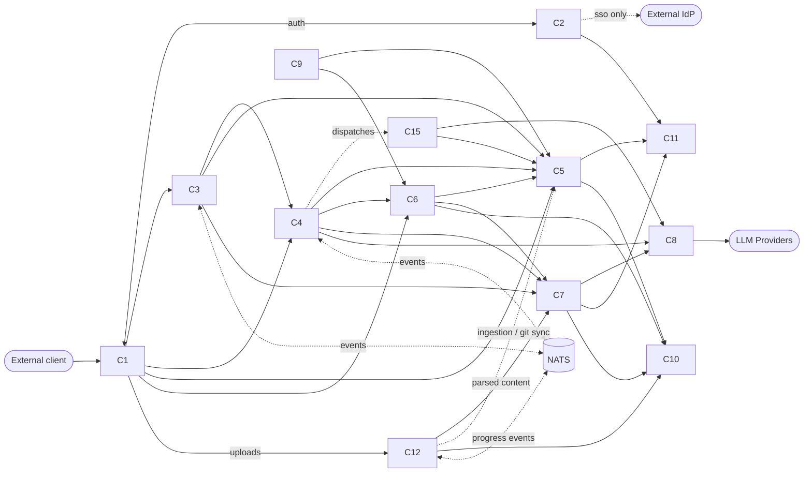

# Architecture Specification — Platform Components & Contracts

> **Purpose of this document.** Define the macro-level component decomposition of the platform, where each type of requirement lives, the contracts between components, the scaling model, and the deployment targets. This spec defines the **what** and the **why** of each component — concrete technology choices and implementation details belong to component-specific engineering work.

> **Version 9 changes.** Phase-3 workflow envelope synthesiser shipped (Q-100-014 resolved). New module `ay_platform_core/_observability/synthesis.py` — pure functions `parse_span_summary`, `group_by_trace`, `synthesise_workflow`, `list_recent_traces`. New `GET /workflows/<trace_id>` and `GET /workflows?recent=N` endpoints on `_observability` (test-tier). Synthesis is **storage-agnostic**: local stack reads the in-memory ring buffer; K8s production will read from Loki / ES via the same algorithm (Q-100-015 tracks the adapter). Q-100-016 added for trace propagation into Kubernetes Jobs (C15 sub-agent runtime).

> **Version 8 changes.** Structured logging + W3C trace propagation implemented. **R-100-104** bumped to v2 (mandatory JSON schema fields formalised: timestamp, component, severity, trace_id, span_id, parent_span_id, tenant_id, message; `event=span_summary` records added by the trace middleware as the foundation for workflow synthesis). **R-100-105** bumped to v2 (every component runs the shared `TraceContextMiddleware`; outbound httpx calls use `make_traced_client` to inject the current `traceparent`; sampling and propagation rules made testable). New shared `LoggingSettings` declares `LOG_LEVEL`, `LOG_FORMAT`, `TRACE_SAMPLE_RATE` as platform-wide knobs (validation_alias, no per-component prefix).

> **Version 7 changes.** Test-tier observability collector formalised: new **R-100-120** (test-tier log aggregator: ring-buffered live Docker log streams, simple HTTP API for the test harness, lives in `ay_platform_core/_observability/`) and **R-100-121** (test-tier components SHALL NOT be deployed in production, no exceptions).

> **Version 6 changes.** Resource limits hardening: **R-100-106** bumped to v2 with both an internal-tier cap (4 vCPU / 8 GB) and a platform-wide cap (8 vCPU / 16 GB). New **R-100-119** mandates explicit limits + reservations on every long-running container, with a baseline budget table per service tier. **R-100-118** bumped to v2 to formalise the **three credential classes** that the single env file must carry: backend bootstrap admin (`*_ROOT_*`), app runtime, and application admin (`C2_LOCAL_ADMIN_*` for AUTH_MODE=local). The coherence test now whitelists infra-bootstrap variables that are consumed only by Docker images / init containers.

> **Version 5 changes.** Env-var single-source refactor + credential hardening. **R-100-110** bumped to v2: a single env file per environment, with each variable appearing exactly once — shared infrastructure facts (Arango URL/DB/credentials, MinIO endpoint/credentials, Ollama URL, `PLATFORM_ENVIRONMENT`) are read **without prefix** by every component via `validation_alias`; the `C{N}_` prefix is reserved for fields that legitimately differ between components. **R-100-111** bumped to v2 to formalise the prefix-vs-alias rule. **R-100-012** bumped to v3: the platform components share a single ArangoDB database (`platform`) and a single MinIO root namespace; isolation is enforced at the **collection / bucket / prefix** level (not at the database level). New **R-100-118** mandates dedicated runtime users for every backing store (no root credentials at runtime) and codifies the bootstrap responsibility of the init containers.

> **Version 4 changes.** §10.3 reworked to reflect the actual application architecture: the Python tier is **one** package (`ay_platform_core`) hosting all in-process FastAPI components (C2–C9, mock LLM). The shared image is renamed from `Dockerfile.python-service` to `Dockerfile.api`, the component to start is selected by a **runtime** environment variable (`COMPONENT_MODULE`) — not a build-arg — and live-reload is no longer baked into the image. New `R-100-117` formalises the tier-Dockerfile layout (`infra/docker/Dockerfile.api`, future `Dockerfile.ui`) as a complement to the per-component `infra/<component>/docker/` pattern. R-100-114 bumped to v2.

> **Version 3 changes.** New §10 *Configuration & Deployment* codifying the configuration architecture that emerged during the v1 implementation of C1–C9: a single `.env`-style file as source of truth for every runtime-overridable parameter, per-component `env_prefix` convention, a platform-wide `PLATFORM_ENVIRONMENT` variable, a completeness coherence test pinning the env-file shape to the Pydantic Settings fields, and the deployable local-stack topology (shared API Dockerfile, compose with `env_file:`, Traefik as the ONLY public port, mock LLM for CI). Adds `R-100-110..R-100-116`. No existing requirement is modified.

> **Version 2 changes.** Alignment with `D-012` (production domain extensibility) and `D-013` (external source ingestion). Component C6 is renamed from "Analysis Engine" to "Validation Pipeline Registry" to reflect its domain-pluggable nature. Hard gates referenced here (via derives-from D-007) are now formulated in domain-agnostic terms. New requirements R-100-080 to R-100-088 cover the external source ingestion capability through C12 + C7 collaboration. Existing auth, scaling, deployment, and failure-domain requirements are unchanged.

---

## 1. Purpose & Scope

This document specifies the platform's component-level architecture at a deliberately macro granularity. It establishes:

- The set of components that compose the platform and their single responsibility.
- Where platform-managed requirements (as data, as rules, as conversation constraints) are hosted.
- Where external sources ingested by users are hosted and processed.
- The contracts between components and the communication styles.
- The scaling model (horizontal/vertical, automatic, per-component).
- The deployment targets (Docker Desktop local, AKS production).
- Failure domains and graceful degradation principles.

**Out of scope.** Language choice per component (Python/Rust split — tracked as Q-100-001), exact library selections, API schemas beyond contract-critical entities, runtime configuration details, tenant isolation beyond namespace strategy, detailed ingestion parsing specifics (deferred to `400-SPEC-MEMORY-RAG.md` pending simplechat/AyExtractor alignment).

---

## 2. Relationship to Synthesis Decisions

| Decision | How this document operationalises it |
|---|---|
| D-002 (stack reuse) | MinIO, ArangoDB, n8n are declared as components C10, C11, C12. Kubernetes is the runtime platform. |
| D-003 (core library + 3 surfaces) | MCP Server is a first-class component (C9); CLI is not a deployed component but a distribution artifact. |
| D-007 (staff-engineer pattern) | The Orchestrator (C4) implements the 5-phase pipeline; sub-agents are ephemeral pods dispatched by C4. Hard gates are domain-agnostic (artifact / validation artifact vocabulary). |
| D-008 (hybrid agent exposure) | The Event Bus (NATS) carries pipeline events consumed by the Conversation Service (C3) for expert mode. |
| D-010 (graph-backed embeddings) | ArangoDB (C11) hosts both the graph and the vector collections; the Memory Service (C7) performs reads. Both the requirements corpus and external sources are embedded. |
| D-011 (LiteLLM abstraction) | The LLM Gateway (C8) is a dedicated component wrapping LiteLLM. No other component calls LLM providers directly. |
| D-012 (domain extensibility) | C6 is a registry of validation plugins. No backbone component hard-codes domain-specific vocabulary in public contracts. |
| D-013 (external source ingestion) | C12 (n8n) handles upload reception, parsing, and ingestion job orchestration. C7 handles embedding computation and indexing. No new component is introduced. Federated retrieval across separated indexes. |

---

## 3. Glossary

| Term | Definition |
|---|---|
| **Component** | A deployable unit with a single responsibility, a stable contract, and independent scaling characteristics. |
| **Contract** | The interface a component exposes (REST endpoints, event topics, RPC methods) with its schema. |
| **Ephemeral pod** | A short-lived Kubernetes pod created per sub-agent task, destroyed on completion. |
| **Failure domain** | The blast radius of a component's failure — what else becomes unavailable. |
| **Identity propagation** | Passing the authenticated user's identity downstream via a signed JWT, so no component re-authenticates. |
| **JWT** | JSON Web Token signed by the Auth Service; uniform across the three auth modes (`none`, `local`, `sso`). |
| **PDP (coarse)** | Policy Decision Point at the Gateway level, enforcing route-level and tenant-level authorization. |
| **PDP (fine)** | Per-component authorization logic for resource-specific actions. |
| **Production domain** | A registered class of artifact (`code`, `documentation`, `presentation`, ...) with its own generation and validation pipelines. |
| **External source** | A user-uploaded document (PDF, text, image, etc.) ingested for RAG. Distinct from produced artifacts. |
| **Federated retrieval** | RAG query mechanism that queries multiple separated indexes (requirements, external sources) with explicit scoping. |

---

## 4. Functional Requirements

### 4.1 Architectural Principles

#### R-100-001

```yaml
id: R-100-001
version: 1
status: draft
category: architecture
```

The platform SHALL decompose its functionality into components such that each component has exactly one responsibility. Overlap of responsibilities between components is a defect.

**Rationale.** Single Responsibility at the component level enables independent evolution, independent scaling, and clear ownership. Overlap creates synchronisation debt.

#### R-100-002

```yaml
id: R-100-002
version: 1
status: draft
category: architecture
```

The platform SHALL be deployable on a minimum footprint suitable for a single-machine local development environment (Docker Desktop + Kubernetes, ≤ 16 GB RAM, ≤ 8 vCPU allocated to the cluster).

**Rationale.** Small-start is a principle of the synthesis (Principle 6). Local parity with production is mandatory for developer productivity and for reproducibility of support cases.

#### R-100-003

```yaml
id: R-100-003
version: 1
status: draft
category: architecture
```

Every functional component of the platform SHALL be stateless. All state SHALL be externalised to declared storage components (C11 ArangoDB, C10 MinIO, or the NATS stream for in-flight events).

**Rationale.** Statelessness is a prerequisite for automatic horizontal scaling, for pod disposability, and for graceful failure recovery. The exceptions (C10, C11) are explicit and contained.

#### R-100-004

```yaml
id: R-100-004
version: 1
status: draft
category: architecture
```

Every functional component SHALL expose Kubernetes liveness and readiness probes. The readiness probe SHALL correctly reflect the component's ability to serve traffic (e.g. downstream dependency connectivity), not merely its process liveness.

**Rationale.** Kubernetes orchestration, auto-scaling, and rolling updates depend on accurate probe semantics. A readiness probe that returns OK while a dependency is unreachable causes cascading failures.

#### R-100-005

```yaml
id: R-100-005
version: 1
status: draft
category: architecture
```

Every functional component SHALL handle SIGTERM gracefully: stop accepting new requests, drain in-flight work within the configured grace period (default 30 s), and exit cleanly. A Kubernetes `preStop` hook SHALL be configured to coordinate graceful shutdown with traffic draining.

**Rationale.** Scaling down and rolling updates must not interrupt in-flight user work. Pods that exit abruptly leak sub-agent jobs and orphan events on the bus.

#### R-100-006

```yaml
id: R-100-006
version: 1
status: draft
category: architecture
```

The platform SHALL NOT rely on session affinity (sticky sessions) at any layer. Any request from an authenticated user SHALL be servable by any replica of the target component.

**Rationale.** Session affinity defeats horizontal scaling, complicates rolling updates, and creates hot replicas. State that would otherwise require affinity lives in C11 (ArangoDB) or NATS.

#### R-100-007

```yaml
id: R-100-007
version: 1
status: draft
category: architecture
```

Every outbound call to an external dependency (LLM providers, external IdPs, user git remotes, user upload sources) SHALL be wrapped by a circuit breaker with fail-fast behaviour. Default thresholds: open after 5 consecutive failures within 30 s, half-open probe after 60 s.

**Rationale.** External dependencies are the primary cause of cascading latency in the platform. Fail-fast preserves user experience and prevents resource exhaustion.

#### R-100-008

```yaml
id: R-100-008
version: 2
status: draft
category: architecture
```

Backbone components (C1 Gateway, C2 Auth, C3 Conversation, C4 Orchestrator, C5 Requirements, C7 Memory, C8 LLM Gateway, C9 MCP Server) SHALL NOT hard-code vocabulary specific to a single production domain (e.g. "code", "test", "function") in their public contracts. Internal domain-specific modules are permitted but SHALL be encapsulated behind domain-agnostic interfaces.

**Rationale.** Per D-012, the backbone is domain-pluggable. Contract-level leakage of domain vocabulary would create breaking-change dependencies when new domains are added.

---

### 4.2 Component Decomposition

The platform v1 comprises **10 internal components** (C1–C9, C15) and **3 external/dependency components** (C10–C12). External IdPs and LLM providers are out-of-cluster dependencies, not components.

#### Component inventory

| ID | Name | Type | Responsibility (one sentence) |
|---|---|---|---|
| C1 | Gateway & Identity | internal | Single entry point: TLS termination, routing, rate limiting, coarse authorization, identity propagation via JWT. |
| C2 | Auth Service | internal | Issue JWTs under one of three pluggable modes (`none`, `local`, `sso`). |
| C3 | Conversation Service | internal | Manage user-facing conversation sessions and the UI-facing event stream (including expert mode). |
| C4 | Orchestrator | internal | Drive the five-phase pipeline, dispatch and supervise sub-agent ephemeral pods, enforce hard gates. |
| C5 | Requirements Service | internal | CRUD and versioning of the StrictDoc corpus; owns the requirements data model. |
| C6 | Validation Pipeline Registry | internal | Host domain-specific validation plugins; run vertical coherence and artifact quality checks. |
| C7 | Memory Service | internal | Embeddings computation, retrieval (federated across indexes), graph traversals over ArangoDB, external source indexing. |
| C8 | LLM Gateway | internal | Single egress to LLM providers via LiteLLM; routing, budgets, per-feature compatibility. |
| C9 | MCP Server | internal | Expose Validation Pipeline Registry and Requirements Service capabilities as MCP tools to external LLM agents. |
| C15 | Sub-agent Runner | internal | Ephemeral pod template dispatched by C4, not a persistent deployment. |
| C10 | Artifact Store | dependency | Object storage for requirements files, generated artifacts, ingested external sources, reports (MinIO). |
| C11 | Graph Store | dependency | Unified vector + graph store for requirements, embeddings, sessions, RBAC, external source metadata (ArangoDB). |
| C12 | Workflow Engine | dependency | External ingestion, post-release sync, automation (n8n). |

The Event Bus (NATS) is infrastructure, not a component. It is addressed in §6.

#### R-100-010

```yaml
id: R-100-010
version: 1
status: draft
category: architecture
```

The platform SHALL implement the component inventory defined above in v1. Introducing a new component SHALL require an amendment to this document and approval per the methodology's review process.

#### R-100-011

```yaml
id: R-100-011
version: 1
status: draft
category: architecture
```

No component SHALL call an LLM provider directly. All LLM calls SHALL route through C8 (LLM Gateway). This rule is enforced by network policies in production.

**Rationale.** D-011 demands a single egress for observability, cost tracking, and provider-swap without code changes.

#### R-100-012

```yaml
id: R-100-012
version: 3
status: draft
category: architecture
```

The platform's components SHALL share a single ArangoDB **database** (named `platform` by convention) and a single MinIO root namespace. Isolation between component-owned data SHALL be enforced at the **collection level** (ArangoDB) and at the **bucket / object-prefix level** (MinIO), not at the database level. Specifically:

- **Requirements Service (C5)** owns the requirements collections and the `requirements` bucket.
- **Memory Service (C7)** owns the embeddings, graph traversal logic, the external source indexing collections, and the `memory` bucket.
- **Auth Service (C2)** owns the identity and RBAC collections.
- **Conversation Service (C3)**, **Orchestrator (C4)**, and **Validation (C6)** own their own collections (and respective buckets where they have one).

No component SHALL access another component's collections or buckets. Cross-component reads go through the owning component's API.

**Rationale.** A single shared database matches the deployment footprint (one ArangoDB cluster) and matches the way the per-component env vars resolve (one shared `ARANGO_DB`, one shared credentials pair via R-100-118). Per-component databases were tried and immediately created drift between `.env.test` and `.env.example`. Collection-level isolation, enforced by the dedicated runtime user (R-100-118) and by code review of the access patterns, gives the same boundary protection without the operational overhead of N databases.

#### R-100-013

```yaml
id: R-100-013
version: 2
status: draft
category: architecture
```

C4 (Orchestrator) SHALL NOT perform validation or static analysis itself. These operations SHALL be delegated to C6 (Validation Pipeline Registry) via its defined contract.

**Rationale.** Keeps orchestration logic separate from validation logic; allows independent scaling; respects the domain-plug-in boundary per D-012.

#### R-100-014

```yaml
id: R-100-014
version: 1
status: draft
category: architecture
```

C15 (Sub-agent Runner) SHALL NOT be a persistent deployment. Each instance is a Kubernetes Job created on-demand by C4, running a bounded task, and terminating on completion or timeout (default 10 minutes).

**Rationale.** Ephemeral execution aligns with the staff-engineer pattern (D-007): fresh context per sub-agent, no cross-task contamination, natural resource reclamation.

#### R-100-015

```yaml
id: R-100-015
version: 2
status: draft
category: architecture
```

C9 (MCP Server) SHALL be a thin wrapper over C5 and C6 APIs. It SHALL NOT implement business logic of its own. Disabling or removing C9 SHALL NOT affect the functionality of any other component.

**Rationale.** D-003 places the core logic in C5/C6; C9 exists only to expose an MCP-compatible surface for external LLM tooling.

#### R-100-016

```yaml
id: R-100-016
version: 1
status: draft
category: architecture
```

C6 (Validation Pipeline Registry) SHALL accept domain validation plugins at build time (v1) and at runtime (v2+). Each plugin declares: the production domain it targets, the list of checks it implements, the artifact formats it parses, and its dependencies on other components.

**Rationale.** Per D-012, the architecture supports progressive addition of domains. v1 ships the `code` plugin; v2 adds `documentation`; v3 adds `presentation`. The plugin contract itself is specified in `700-SPEC-VERTICAL-COHERENCE.md`.

---

### 4.3 Requirements Placement

Platform-managed requirements (user project requirements, platform's own requirements, and decisions) are hosted across three planes:

#### Plane 1 — Requirements as data

Source of truth, physical storage, versioned history.

| Artifact | Component | Storage detail |
|---|---|---|
| `.sdoc` / `.md` files (text source of truth) | C10 Artifact Store | MinIO bucket per project, S3 versioning enabled |
| Parsed entity metadata (id, version, status, category, relations) | C11 Graph Store | ArangoDB document collections |
| Entity-to-entity relations (derives-from, impacts, tailoring-of, supersedes) | C11 Graph Store | ArangoDB edge collections |
| Embeddings | C11 Graph Store | ArangoDB vector collection (index `requirements`) |
| Git history (if project opts into Git sync) | C12 Workflow Engine → user's remote | n8n workflows |

#### Plane 2 — Requirements as rules applied to produced artifacts

| Operation | Component |
|---|---|
| Load requirement corpus for validation | C5 → C11 (read) |
| Parse produced artifacts for `@relation` markers (see methodology §8) | C6 via domain-specific parser |
| Execute MUST/SHOULD/COULD coherence checks | C6 (per active domain plugin) |
| Produce coherence reports (blocking + advisory findings) | C6 → C10 (report artifact) |

#### Plane 3 — Requirements as constraints on conversation

| Operation | Component |
|---|---|
| Load contextual requirements for a pipeline phase | C4 → C5 |
| Retrieve semantically relevant requirements (RAG) | C4 → C7 |
| Expose requirement surface to user UI | C3 reads from C5 and C7 |
| Expose pipeline events (phase, agent, artifacts) for expert mode | C3 subscribes to NATS events from C4 |

#### R-100-020

```yaml
id: R-100-020
version: 1
status: draft
category: architecture
```

The source of truth for a requirement's textual content SHALL be the `.md` file in C10 (Artifact Store). Metadata in C11 (Graph Store) SHALL be a derived index, rebuildable from the source files.

**Rationale.** Textual corpus is the git-versionable, human-auditable artifact. Index rebuild capability allows C11 to be treated as a cache for indexing purposes.

#### R-100-021

```yaml
id: R-100-021
version: 1
status: draft
category: architecture
```

Writes to the requirement corpus SHALL always go through C5 (Requirements Service). Direct writes to C10 or C11 by other components are prohibited. C12 may read from C5 but SHALL NOT write directly.

**Rationale.** C5 owns the consistency invariants between the `.md` file, the indexed metadata, and the relation graph. Bypassing C5 creates desync.

#### R-100-022

```yaml
id: R-100-022
version: 1
status: draft
category: architecture
```

C5 SHALL provide an idempotent "reindex" operation that rebuilds C11 metadata from C10 source files. This operation SHALL be safe to run while the platform is serving traffic (no downtime).

**Rationale.** Recovery from index corruption, schema migration, embedding model upgrade — all require rebuild capability.

---

### 4.4 Authentication & Authorization

#### Authentication: three pluggable modes

The platform SHALL support three mutually exclusive authentication modes, selected at deployment time via configuration.

#### R-100-030

```yaml
id: R-100-030
version: 1
status: draft
category: security
```

C2 (Auth Service) SHALL support three pluggable authentication modes: `none`, `local`, `sso`. The active mode SHALL be set by configuration at deployment time and SHALL NOT change at runtime.

**Rationale.** Mode switches at runtime introduce complex state-migration issues for in-flight sessions. Restart-to-switch is an acceptable operational constraint.

#### R-100-031

```yaml
id: R-100-031
version: 1
status: draft
category: security
```

In `none` mode, C2 SHALL issue a JWT for a single system-wide user `john.doe` for any incoming authentication request, without credential verification. All sessions in `none` mode SHALL share the same user identity and the same project memory.

**Rationale.** `none` mode targets single-user demos, tutorials, and local development. It is deliberately not safe for multi-user concurrent usage.

#### R-100-032

```yaml
id: R-100-032
version: 1
status: draft
category: security
```

The platform SHALL refuse to start in `none` mode if the environment variable `PLATFORM_ENVIRONMENT` is set to `production` or `staging`. The startup check SHALL fail with a non-zero exit code and a loud log message. Deployment manifests for production SHALL set this variable explicitly.

**Rationale.** `none` mode in production is a security catastrophe. This guard is non-bypassable at the code level, not just documented as a convention.

#### R-100-033

```yaml
id: R-100-033
version: 1
status: draft
category: security
```

When running in `none` mode, the UI SHALL display a persistent, visible banner stating "INSECURE DEV MODE — NO AUTHENTICATION". The banner SHALL NOT be dismissible and SHALL be rendered by the Gateway (C1) to prevent its removal by compromised downstream components.

**Rationale.** Visual hazard signal is the last line of defence when a dev instance is inadvertently exposed.

#### R-100-034

```yaml
id: R-100-034
version: 1
status: draft
category: security
```

In `local` mode, C2 SHALL store user credentials as `(username, argon2id_hash, salt, metadata)` tuples in a dedicated ArangoDB collection. Other hashing algorithms (bcrypt, scrypt, sha256, pbkdf2, plaintext) SHALL NOT be permitted.

**Rationale.** argon2id is the current state-of-the-art password hashing function (winner of the Password Hashing Competition, recommended by OWASP). No legitimate reason to use anything weaker in a new system.

#### R-100-035

```yaml
id: R-100-035
version: 1
status: draft
category: security
```

In `local` mode, password self-service recovery (reset-by-email) SHALL NOT be implemented in v1. Password resets SHALL require administrator action via an admin CLI or admin UI.

**Rationale.** Self-service reset requires an email transport stack (SMTP, deliverability, templating) that expands attack surface and operational burden without clear v1 value. Deferred to v2 alongside the MFA work.

#### R-100-036

```yaml
id: R-100-036
version: 1
status: draft
category: security
```

Multi-factor authentication (MFA) SHALL be out of scope for v1 across all three modes. In `sso` mode, MFA enforcement is delegated to the external IdP and is not the platform's concern.

**Rationale.** MFA in `local` mode would require TOTP/WebAuthn support. Deferred as a v2 roadmap item. `sso` mode inherits whatever the external IdP enforces.

#### R-100-037

```yaml
id: R-100-037
version: 1
status: draft
category: security
```

In `sso` mode, C2 SHALL integrate with external OIDC-compliant identity providers via oauth2-proxy (variant A). The platform SHALL NOT self-host an IdP in v1; Keycloak deployment is not in scope.

**Rationale.** Delegating to managed IdPs (Auth0, Microsoft Entra, Google Workspace, or a tenant's Keycloak) reduces operational burden and attack surface.

#### R-100-038

```yaml
id: R-100-038
version: 1
status: draft
category: security
```

All three authentication modes SHALL emit JWTs with an identical claim structure (see E-100-001). Downstream components SHALL NOT need to know which authentication mode was used to serve a request. The `auth_mode` claim is informative only, used for audit purposes.

**Rationale.** Uniformity downstream is the whole point of centralising auth behind C2. Divergent JWT structures per mode would defeat that goal.

#### R-100-039

```yaml
id: R-100-039
version: 1
status: draft
category: security
```

C1 (Gateway) SHALL enforce rate limiting on authentication endpoints (`/auth/login`, `/auth/token`). Default limits: 10 requests per minute per source IP, 5 consecutive failed logins per account trigger a 15-minute account lock in `local` mode.

**Rationale.** Password brute-force and credential stuffing are the most common attacks on auth endpoints. Rate limits at the gateway prevent C2 overload and slow attackers.

#### Authorization: always managed internally

#### R-100-040

```yaml
id: R-100-040
version: 1
status: draft
category: security
```

Authorization decisions (what a user can do) SHALL be managed internally by the platform, regardless of the active authentication mode. External IdPs, when used for authentication, SHALL NOT be queried for authorization decisions.

**Rationale.** Externalising authorization to an IdP would create tight coupling, high latency, and limited expressiveness for platform-specific permissions (per-project roles, per-requirement ownership).

#### R-100-041

```yaml
id: R-100-041
version: 1
status: draft
category: security
```

The v1 authorization model SHALL be role-based (RBAC) with three global roles (`admin`, `tenant_admin`, `user`) and three per-project scoped roles (`project_owner`, `project_editor`, `project_viewer`). The full role-permission matrix SHALL be defined in E-100-002.

**Rationale.** RBAC covers the expected v1 use cases. ABAC is a v2 consideration if concrete unmet requirements emerge.

#### R-100-042

```yaml
id: R-100-042
version: 1
status: draft
category: security
```

Coarse-grained authorization decisions (route-level access, tenant isolation, global quotas) SHALL be enforced by C1 (Gateway) using the JWT claims. Fine-grained authorization decisions (resource-specific actions within a project) SHALL be enforced by the component that owns the resource.

**Rationale.** Coarse at the edge stops unauthorised traffic early. Fine-grained at the component respects component ownership and keeps business logic co-located with enforcement.

---

### 4.5 Scaling Model

#### R-100-050

```yaml
id: R-100-050
version: 1
status: draft
category: architecture
```

Every stateless component (C1–C9, excluding ephemeral C15) SHALL be horizontally scalable via Kubernetes Horizontal Pod Autoscaler (HPA) with the following default metrics: CPU utilisation (target 70%), memory utilisation (target 75%), and custom application metrics where justified.

**Rationale.** CPU and memory are the baseline. Custom metrics (e.g. queue depth for C4, embedding request rate for C7) provide better signal for uneven workloads and SHOULD be added per-component as data becomes available.

#### R-100-051

```yaml
id: R-100-051
version: 1
status: draft
category: architecture
```

Every horizontally scalable component SHALL have `minReplicas=1` and `maxReplicas` configured per-component based on observed capacity. The platform SHALL operate correctly at `minReplicas=1` for all components on a single-machine deployment.

**Rationale.** Minimum one replica enables local development. Maximum replicas prevents runaway scaling from exhausting cluster resources.

#### R-100-052

```yaml
id: R-100-052
version: 1
status: draft
category: architecture
```

Scale-down behaviour SHALL include a stabilisation window (default 5 minutes) to prevent thrashing under bursty loads. Scale-up behaviour SHALL be fast (stabilisation ≤ 60 seconds) to preserve user-perceived latency.

**Rationale.** Asymmetric stabilisation: react fast to load, slow to relief. Standard HPA practice.

#### R-100-053

```yaml
id: R-100-053
version: 1
status: draft
category: architecture
```

C11 (ArangoDB) SHALL scale vertically for the primary node in v1. Read replicas MAY be added horizontally when read-heavy workloads (retrieval, coherence checks, source ingestion queries) demonstrably exceed the primary's capacity. Horizontal write scaling is out of scope for v1.

**Rationale.** ArangoDB's SmartGraph sharding is powerful but adds complexity not justified at v1 scale. Vertical scaling + read replicas cover a wide range of load.

#### R-100-054

```yaml
id: R-100-054
version: 1
status: draft
category: architecture
```

C10 (MinIO) SHALL be deployed in distributed mode in production (4 or more nodes) for data durability. In local development, single-node mode is acceptable.

**Rationale.** MinIO's distributed mode provides erasure coding and node failure tolerance; single-node is adequate for development but loses durability guarantees.

#### R-100-055

```yaml
id: R-100-055
version: 1
status: draft
category: architecture
```

C15 (Sub-agent Runner) SHALL scale by instantiation: each dispatched sub-agent is one Kubernetes Job. The Orchestrator (C4) SHALL enforce a per-project concurrency limit (default 5 concurrent sub-agents per project, configurable per tenant) to prevent resource exhaustion.

**Rationale.** Sub-agent pods are the most resource-intensive units of work (memory-heavy LLM context, tool exec). Unbounded concurrency from a single project could starve others.

#### R-100-056

```yaml
id: R-100-056
version: 1
status: draft
category: architecture
```

The platform SHALL NOT require any component to be manually scaled. All scaling decisions SHALL be taken by the cluster's autoscaling machinery based on declared policies.

**Rationale.** "Scaling by design, automatically" as per user requirement. Manual scaling is an operational anti-pattern that doesn't survive growth.

---

### 4.6 Deployment Targets

#### R-100-060

```yaml
id: R-100-060
version: 1
status: draft
category: infrastructure
```

The platform SHALL deploy identically on two target environments: Docker Desktop with built-in Kubernetes (local, macOS and Linux) and Azure Kubernetes Service (AKS, production). The same Helm charts (or equivalent manifests) SHALL be used for both; differences are expressed through values files.

**Rationale.** Environment parity is a prerequisite for reproducible issues, trustworthy pre-prod testing, and fast iteration.

#### R-100-061

```yaml
id: R-100-061
version: 1
status: draft
category: infrastructure
```

The platform SHALL be deployable to the local target in under 10 minutes from a clean cluster, including initialisation of C10 (MinIO buckets) and C11 (ArangoDB collections and indexes).

**Rationale.** Fast local deploy is a developer productivity metric. Slow deploys discourage local iteration.

#### R-100-062

```yaml
id: R-100-062
version: 1
status: draft
category: infrastructure
```

All platform components SHALL be deployed in a single Kubernetes namespace per installation. Multi-tenant isolation SHALL be achieved by logical isolation (tenant-scoped data, JWT claims, RBAC) rather than by namespace-per-tenant.

**Rationale.** Namespace-per-tenant was considered and rejected for v1 due to operational overhead (per-tenant TLS certs, network policies, resource quotas). Logical isolation is sufficient when authorization is enforced consistently. Migration path to namespace-per-tenant is preserved by not relying on cross-tenant network reachability.

#### R-100-063

```yaml
id: R-100-063
version: 1
status: draft
category: infrastructure
```

The platform SHALL NOT depend on cloud-provider-specific services that are not available as equivalent in the local target. For example, managed Postgres services (Azure Database for PostgreSQL) SHALL NOT be assumed; ArangoDB runs in-cluster in both targets.

**Rationale.** Cloud-specific dependencies break parity and create vendor lock-in. The stack (D-002) was chosen in part for its portability.

---

### 4.7 Failure Domains & Graceful Degradation

#### R-100-070

```yaml
id: R-100-070
version: 1
status: draft
category: architecture
```

The platform SHALL define explicit failure domains for each dependency and document degraded-mode behaviour. Minimum declared failure domains: LLM provider unreachable, C11 (ArangoDB) unreachable, C10 (MinIO) unreachable, external IdP unreachable, NATS unreachable, C12 (n8n) unreachable.

#### R-100-071

```yaml
id: R-100-071
version: 1
status: draft
category: architecture
```

When an LLM provider is unreachable, the platform SHALL: return a clear error to the user (not a timeout), log a structured event, and, if fallback providers are configured (see D-011 level 2+, v2 scope), retry with the fallback. In v1, a single provider failure is a user-facing error.

#### R-100-072

```yaml
id: R-100-072
version: 1
status: draft
category: architecture
```

When C11 (ArangoDB) is unreachable, the platform SHALL return 503 Service Unavailable from all endpoints that require read or write access to the corpus. The platform SHALL NOT serve stale cached data as fresh in this state.

**Rationale.** The corpus is the source of truth; serving stale data risks silent divergence between what the user sees and what is actually stored. Honest unavailability is preferable.

#### R-100-073

```yaml
id: R-100-073
version: 1
status: draft
category: architecture
```

When the external IdP is unreachable in `sso` mode, existing valid JWTs SHALL continue to be accepted until their expiration. New login attempts SHALL fail with a clear message. Session refresh SHALL fail gracefully when the refresh requires IdP contact.

**Rationale.** Short-term IdP outages should not invalidate existing user sessions. Defense in depth: the JWT carries enough state for downstream authorization without IdP contact.

#### R-100-074

```yaml
id: R-100-074
version: 1
status: draft
category: architecture
```

When NATS is unreachable, the platform's conversational path (user → C3) SHALL continue to function, but expert mode features (phase transitions, agent dispatch events, live pipeline visualisation) SHALL be unavailable and SHALL display a "pipeline telemetry unavailable" indicator.

**Rationale.** Telemetry is not on the critical path of user value. Losing it should degrade the expert-mode UX, not break core functionality.

#### R-100-075

```yaml
id: R-100-075
version: 2
status: draft
category: architecture
```

When C12 (n8n) is unreachable, the platform's conversational and generation paths SHALL continue to function. External source ingestion (upload, parsing) SHALL queue uploads for later processing and inform the user that sources will be indexed when service is restored. Already-indexed sources remain fully available for retrieval.

**Rationale.** Ingestion is asynchronous by nature and should not block interactive workflows. Queueing uploads aligns with user expectations for upload progress and eventual consistency.

---

### 4.8 External Source Ingestion

This subsection operationalises D-013 at the architecture level. Detailed parsing, chunking, and retrieval specifics are deferred to `400-SPEC-MEMORY-RAG.md`, pending alignment with simplechat/AyExtractor prior work.

#### R-100-080

```yaml
id: R-100-080
version: 1
status: draft
category: functional
```

The platform SHALL accept external source uploads from authenticated users for indexing into their project's RAG context. The supported formats in v1 SHALL be limited to: PDF (`.pdf`), Markdown (`.md`), plain text (`.txt`), and images (`.png`, `.jpg`, `.jpeg`). Other formats SHALL be rejected with a clear error message.

**Rationale.** Minimum v1 format set per D-013. Progressive format expansion in later versions.

#### R-100-081

```yaml
id: R-100-081
version: 1
status: draft
category: architecture
```

The ingestion pipeline SHALL be implemented through the collaboration of C12 (Workflow Engine, n8n) and C7 (Memory Service). C12 SHALL own: upload reception, per-format parsing and text extraction, chunking, and job orchestration (retry, status tracking). C7 SHALL own: embedding computation and indexing into C11 (ArangoDB) within the `external_sources` index.

**Rationale.** Per D-013 decision. Reuse of existing components over introduction of a new component. n8n's workflow capabilities and available parsing nodes are leveraged; C7 remains the sole owner of embeddings and indexing.

#### R-100-082

```yaml
id: R-100-082
version: 1
status: draft
category: architecture
```

The raw uploaded source files SHALL be persisted in C10 (Artifact Store, MinIO) within a bucket scoped to the owning project. File deletion by the user SHALL cascade to removal from C10 and to index removal in C11.

**Rationale.** Source files are project assets and must survive ingestion for re-indexing (model upgrade, chunking strategy change). Cascade deletion prevents orphan storage.

#### R-100-083

```yaml
id: R-100-083
version: 1
status: draft
category: security
```

External sources SHALL be scoped to a single project. Cross-project source sharing SHALL NOT be supported in v1. A user's access to a source SHALL follow the project-level RBAC rules (see E-100-002).

**Rationale.** Per-project scoping is the simplest safe default. Cross-project sharing introduces complex permission-propagation scenarios deferred to later versions.

#### R-100-084

```yaml
id: R-100-084
version: 1
status: draft
category: functional
```

Retrieval across the RAG corpus SHALL be **federated** across two separated indexes in C11: the `requirements` index (owned by C5) and the `external_sources` index (owned by C7). Retrieval API consumers SHALL specify whether a query targets `requirements`, `external_sources`, or both with explicit weighting.

**Rationale.** Per D-013. Preventing index mixing avoids contamination: a snippet from a user-uploaded PDF must not be returned as if it were a requirement.

#### R-100-085

```yaml
id: R-100-085
version: 1
status: draft
category: functional
```

The ingestion pipeline SHALL implement deduplication at the file level: uploading the same file (identified by content hash) to the same project SHALL result in a single persisted source and a single set of embeddings. Subsequent uploads update the file's metadata (upload timestamps, uploader) without re-running parsing or embedding.

**Rationale.** Prevents storage bloat and unnecessary embedding cost. Content-hash-based deduplication is the standard approach.

#### R-100-086

```yaml
id: R-100-086
version: 1
status: draft
category: functional
```

External sources SHALL be versioned: replacing a previously uploaded source file SHALL preserve the prior version as historical. The retrieval index SHALL return results from the current version only; older versions are accessible via explicit history queries.

**Rationale.** Users legitimately update specifications, drawings, or documentation. Losing history would break traceability; serving stale versions in retrieval would confuse the RAG.

#### R-100-087

```yaml
id: R-100-087
version: 1
status: draft
category: nfr
```

The ingestion pipeline SHALL be asynchronous from the user's point of view. Upload requests SHALL return immediately with a job identifier; the UI SHALL poll or subscribe (via NATS) to report progress, completion, or failure. Ingestion SHALL NOT block the conversational workflow.

**Rationale.** Parsing and embedding can take tens of seconds to minutes for large documents. Synchronous ingestion would kill the UX.

#### R-100-088

```yaml
id: R-100-088
version: 1
status: draft
category: functional
```

The platform SHALL enforce per-project storage quotas for external sources, configurable per tenant. Default quota: 1 GB per project. Exceeding the quota SHALL cause upload rejection with a clear error. Quota monitoring SHALL be accessible via the project admin UI.

**Rationale.** External sources can grow unbounded if unchecked. Quotas prevent cost runaway and abusive usage. Defaults are conservative; operators tune per tenant.

---

## 5. Non-Functional Requirements

### R-100-100

```yaml
id: R-100-100
version: 1
status: draft
category: nfr
```

C1 (Gateway) SHALL add no more than 20 ms of p95 latency to a downstream request in normal operation (excluding authentication logic that itself may require a JWT verification or IdP token exchange).

**Rationale.** The gateway is on every request path; latency budget must be tight.

### R-100-101

```yaml
id: R-100-101
version: 1
status: draft
category: nfr
```

C2 (Auth Service) SHALL issue a JWT in under 100 ms p95 in `local` and `none` modes. `sso` mode latency is bounded by the IdP and is documented but not controlled.

**Rationale.** Auth is on the login path; a slow login ruins first impression. IdP latency is explicitly outside platform control.

### R-100-102

```yaml
id: R-100-102
version: 1
status: draft
category: nfr
```

Cold-start scaling of any stateless component from 1 to 2 replicas SHALL complete in under 30 seconds (image pull cache hit). Cold-start from 0 to 1 replica SHALL complete in under 60 seconds.

**Rationale.** Scale-up latency directly impacts user-perceived responsiveness under load bursts.

### R-100-103

```yaml
id: R-100-103
version: 1
status: draft
category: nfr
```

The platform SHALL expose Prometheus-compatible metrics endpoints on every internal component. Metrics SHALL include at minimum: request rate, error rate, latency percentiles (p50, p95, p99), resource utilisation.

**Rationale.** Observability baseline. Custom metrics come on top; these four are mandatory.

### R-100-104

```yaml
id: R-100-104
version: 2
status: approved
category: nfr
```

Every component SHALL emit logs as **JSON lines** (one record per line), produced by the shared `JSONFormatter` from `ay_platform_core.observability.formatter`. Each line SHALL carry the following fields:

| Field | Type | Source |
|---|---|---|
| `timestamp` | RFC 3339, UTC | record creation time |
| `component` | string | passed to `configure_logging(component=…)` (the `COMPONENT_MODULE` value) |
| `severity` | enum: DEBUG / INFO / WARNING / ERROR / CRITICAL | LogRecord level |
| `trace_id` | hex(32) or "" | ContextVar (set by middleware) |
| `span_id` | hex(16) or "" | ContextVar |
| `tenant_id` | string or "" | ContextVar (set from JWT, see R-100-118) |
| `message` | string | log call's message (`record.getMessage()`) |
| `logger` | string | logger name (e.g. `uvicorn.access`) |

Free-form `extra={…}` payloads SHALL be merged into the JSON object verbatim (after JSON-safe coercion). When an exception is logged, the formatted traceback SHALL be exposed under `exc_info`.

In `LOG_FORMAT=text` (dev only), the text formatter mirrors the same field set in a single human-readable line.

**Special record: `event=span_summary`.** The shared `TraceContextMiddleware` SHALL emit one such record at the end of every HTTP request, with extra fields `event=span_summary`, `method`, `path`, `status_code`, `duration_ms`, `parent_span_id`, `sampled`. These records are the input to phase-3 workflow synthesis (see Q-100-014): grouping by `trace_id` + reconstructing parent/child via `parent_span_id` yields the full cross-component workflow envelope.

**Rationale.** v1 left "structured" undefined; v2 fixes the schema in code (`JSONFormatter`) so log aggregators can parse without per-component handling. The `span_summary` record turns every request into a discrete, structured fact — pre-computed material for any future synthesiser, no schema migration needed.

### R-100-105

```yaml
id: R-100-105
version: 2
status: approved
category: nfr
```

The platform SHALL propagate W3C Trace Context (`traceparent` header) across all HTTP inter-component calls. Implementation:

- Every component SHALL register the shared `TraceContextMiddleware` from `ay_platform_core.observability` on its FastAPI app. The middleware:
  - parses an inbound `traceparent`;
  - if valid, generates a fresh span_id (kept within the inherited trace) and stores the inbound span_id as the request's `parent_span_id`;
  - if absent or malformed, generates a fresh trace, applying `TRACE_SAMPLE_RATE` for the sampled flag;
  - emits a `traceparent` response header carrying the request's own (trace_id, span_id, sampled);
  - sets the `(trace_id, span_id, parent_span_id)` triple on ContextVars for the request's lifetime.
- Every outbound HTTP call from a component SHALL go through `make_traced_client(...)` (a `httpx.AsyncClient` factory). The factory installs an event hook that injects the current `traceparent` on the outgoing request. Direct `httpx.AsyncClient(...)` instantiation is forbidden in component code (replaced by `make_traced_client` in c8_llm/client.py, c7_memory/embedding/ollama.py, c9_mcp/main.py, …).
- Sampling: `TRACE_SAMPLE_RATE` (env-var, default 1.0 local) controls fresh trace sampling. Inbound traces with `sampled=true` SHALL be honoured regardless of the local rate (defer to upstream's decision).
- Tenant id: components MAY call `set_tenant_id(...)` from the middleware that processes the JWT, so subsequent log lines carry the tenant attribution mandated by R-100-104 / R-100-107.

**Rationale.** Multi-component workflows (conversation → orchestrator → sub-agents → validation → LLM) are impossible to debug without a unified trace. v2 makes the implementation contract explicit — middleware + httpx factory — so a new component cannot accidentally break the chain by instantiating a raw httpx client. Combined with R-100-104 v2 `span_summary` records, the workflow envelope (Q-100-014) becomes derivable without further code changes.

### R-100-106

```yaml
id: R-100-106
version: 2
status: draft
category: nfr
```

The resource footprint of the platform at minimum deployment (all components at `minReplicas=1`, no active user load) SHALL not exceed:

- **4 vCPU** and **8 GB RAM** across all internal components C1–C9
  (the "internal tier") — excluding dependency stores (C10–C12) and
  embedding/inference servers (Ollama, mock LLM).
- **8 vCPU** and **16 GB RAM** across the entire platform (internal
  tier + dependencies + inference) — typical Docker Desktop / dev
  workstation envelope.

These caps SHALL be enforced declaratively via `deploy.resources.limits`
on every long-running compose service, and via `resources.limits` on
every K8s `Deployment` / `StatefulSet` (R-100-119). One-shot init
containers (`arangodb_init`, `minio_init`, `ollama_model_seed`,
`c12_workflow_seed`) are exempt — their memory peak is ephemeral.

**Rationale.** Small-start principle. Aggregate resource consumption
at idle sets the lower bound of the feasible deployment envelope. v2
adds the platform-wide cap because the v1 wording covered only the
internal tier; on a laptop, the dependencies (Arango, MinIO, Ollama)
together can dwarf the internal tier — they need their own ceiling.

### R-100-107

```yaml
id: R-100-107
version: 1
status: draft
category: nfr
```

The platform SHALL persist end-to-end cost tracking per user, per project, and per sub-agent dispatch in C11. Cost data SHALL be queryable and retained for at least 90 days.

**Rationale.** LLM costs are material and tenant-attributable; cost tracking is a business requirement and an operational safeguard (runaway detection).

### R-100-108

```yaml
id: R-100-108
version: 1
status: draft
category: nfr
```

External source ingestion throughput SHALL be sufficient to process a typical 50-page PDF (parsing, chunking, embedding) within 2 minutes p95 on standard deployment resources. Larger documents MAY take proportionally longer.

**Rationale.** Establishes a user-observable performance expectation for the ingestion UX. Longer waits degrade the "upload and go back to work" experience.

---

## 6. Interfaces & Contracts

### 6.1 Communication styles

| Communication type | Style | Rationale |
|---|---|---|
| External client → C1 (Gateway) | HTTPS + REST/JSON (+ WebSocket for conversation streams) | Standard web client. |
| C1 → downstream internal components | HTTP + REST/JSON, JWT in `Authorization: Bearer` header | Uniform internal traffic. Internal TLS enforced via mTLS (v2) or service mesh. |
| C4 (Orchestrator) → C15 (Sub-agent Runner) | Kubernetes Jobs API; result via MinIO path + NATS event | Native K8s; natural isolation. |
| C8 (LLM Gateway) → LLM providers | OpenAI-compatible REST over HTTPS | Imposed by D-011. |
| Any component → C11 (ArangoDB) | ArangoDB native protocol (HTTP or TCP) | Owner-component-only per R-100-012. |
| Any component → C10 (MinIO) | S3-compatible API over HTTPS | Standard. |
| Any component → NATS | NATS protocol (TCP) | Event bus. |
| C9 (MCP Server) ↔ external LLM agents | MCP protocol over stdio or SSE | Imposed by MCP. |
| User session → IdP (in `sso` mode) | OIDC flow (authorization code + PKCE) | Standard. |
| User upload → C1 → C12 ingestion workflow | HTTPS multipart upload; async job id; NATS progress events | Async upload pattern. |

### 6.2 Contracts to be formalised

The following contracts are declared here and fully specified in the owning component's detailed spec or in the entities below.

| Contract | Consumer → Producer | Detailed in |
|---|---|---|
| JWT claim schema | all internal → C2 | E-100-001 (this doc) |
| RBAC model | C1, C3, C4, C5, C6, C7 → C2 | E-100-002 (this doc) |
| NATS event taxonomy (pipeline events, ingestion progress events) | C3 ← C4, C3 ← C12 | 200-SPEC-PIPELINE-AGENT, 400-SPEC-MEMORY-RAG |
| Requirements CRUD API | C3, C4, C6, C9 → C5 | 300-SPEC-REQUIREMENTS-MGMT |
| Validation pipeline API | C4, C9 → C6 | 700-SPEC-VERTICAL-COHERENCE |
| Retrieval API (federated: requirements + external sources) | C4 → C7 | 400-SPEC-MEMORY-RAG |
| Ingestion job API | C12 → C7 (embedding + indexing) | 400-SPEC-MEMORY-RAG |
| LLM completion API | C3, C4 → C8 | 800-SPEC-LLM-ABSTRACTION |
| Sub-agent job manifest | C4 → C15 | 200-SPEC-PIPELINE-AGENT |
| MCP tool schema | external → C9 | 300-SPEC-REQUIREMENTS-MGMT + 700-SPEC-VERTICAL-COHERENCE |
| Domain validation plugin contract | C6 ← domain plugins | 700-SPEC-VERTICAL-COHERENCE |

### 6.3 Contract-critical entities

#### E-100-001: Platform-internal JWT claim schema

```yaml
id: E-100-001
version: 1
status: draft
category: architecture
```

The JWT issued by C2 SHALL contain the following claims, in JSON structure. Fields marked `optional` MAY be absent.

```json
{
  "iss": "platform-auth",
  "sub": "<user-id>",
  "aud": "platform",
  "iat": 1700000000,
  "exp": 1700003600,
  "jti": "<unique-token-id>",

  "auth_mode": "none" | "local" | "sso",
  "tenant_id": "<tenant-id>",

  "roles": ["user" | "admin" | "tenant_admin"],
  "project_scopes": {
    "<project-id>": ["owner" | "editor" | "viewer"]
  },

  "name": "<display name, optional>",
  "email": "<optional, may be absent in none mode>"
}
```

**Signing.** HS256 in development, RS256 or EdDSA in production. The signing key is rotated per Q-100-005.

**Expiration.** Default 1 hour. Refresh tokens out of scope for v1; users re-authenticate on expiry.

#### E-100-002: RBAC model

```yaml
id: E-100-002
version: 1
status: draft
category: security
```

The platform's RBAC model comprises:

**Global roles** (stored in JWT `roles` claim):

| Role | Permissions |
|---|---|
| `admin` | All actions across all tenants. Reserved for platform operators. |
| `tenant_admin` | All actions within their `tenant_id`. Can create projects, manage users within tenant. |
| `user` | Baseline. Can hold project scopes; cannot administer tenant. |

**Project scoped roles** (stored in JWT `project_scopes` claim, per project):

| Role | Permissions (including external source operations) |
|---|---|
| `project_owner` | All actions on the project, including deletion, ACL management, source uploads, and source deletion. |
| `project_editor` | Create/edit requirements, run pipeline, upload sources, view reports. Cannot delete project, change ACL, or delete sources uploaded by others. |
| `project_viewer` | Read-only access to requirements, reports, sources, conversation history. Cannot trigger pipeline or upload sources. |

**Permission resolution.** A user's effective permission on a resource is the union of their global roles and their project-scoped roles for that resource's project. The most permissive applicable rule wins (principle of most-privilege-needed, within what the roles allow).

**Persistence.** The authoritative RBAC data (users, tenants, project memberships, role assignments) lives in dedicated ArangoDB collections owned by C2.

#### E-100-003: Component dependency graph

```yaml
id: E-100-003
version: 2
status: draft
category: architecture
```



Arrows indicate synchronous calls. Dotted lines indicate event-driven or infrequent interactions. Storage dependencies (C10, C11) are owner-restricted per R-100-012.

---

## 7. Open Questions

| ID | Question | Owning decision | Target resolution |
|---|---|---|---|
| Q-100-001 | Which components, if any, require Rust (vs Python) for performance, memory, or safety reasons? | D-002, D-003 | v1 (per-component as implementation starts) |
| Q-100-002 | Exact LiteLLM deployment shape: sidecar per component, shared service, or both? | D-011 | v1 (likely shared service per R-100-011, to confirm in `800`) |
| Q-100-003 | Sub-agent pod lifecycle details: init container, MinIO sync strategy (pull on start, push on exit), timeout per phase type. | D-007 | v1 (detailed in `200-SPEC-PIPELINE-AGENT`) |
| Q-100-004 | Exact NATS deployment (JetStream enabled, stream persistence, retention policy). | — | v1 (can be decided at deploy time; baseline: JetStream enabled, 7-day retention) |
| Q-100-005 | JWT signing key rotation strategy (how often, how propagated to verifiers, grace period). | D-011 | v1 (security-critical; likely 90-day rotation with dual-key verification during grace) |
| Q-100-006 | Choice of reverse proxy in C1: Traefik (baseline per variant A discussion) vs alternative. | — | v1 (baseline Traefik unless concrete objection) |
| Q-100-007 | Exact tenant-to-project assignment model (many-to-many? project-can-span-tenants?). | — | v1 (detailed in `500-SPEC-UI-UX` alongside project creation flow) |
| Q-100-008 | Cost tracking granularity: per-request, per-session, per-phase, per-sub-agent? Storage schema? | D-011 | v1 (detailed in `800-SPEC-LLM-ABSTRACTION`) |
| Q-100-009 | Secret management (LiteLLM API keys, JWT signing keys, ArangoDB passwords): K8s Secrets, external vault (Azure Key Vault), or both? | — | v1 (baseline: K8s Secrets locally, Azure Key Vault in AKS) |
| Q-100-010 | Resource quotas per tenant (CPU, memory, sub-agent concurrency, cost budget): enforcement layer? | — | v2 (billing/metering likely a v2 concern) |
| Q-100-011 | Ingestion parsing library alignment with simplechat/AyExtractor (docling candidate vs actual prior choice). | D-013 | v1 (pending upload of simplechat/AyExtractor specs) |
| Q-100-012 | Ingestion chunking strategy (fixed size, structure-aware, semantic): align with prior work. | D-013 | v1 (pending upload) |
| Q-100-013 | Storage quota per project default (1 GB baseline in R-100-088) and tenant-level override mechanism. | D-013 | v1 (detailed in `400` and `500`) |
| Q-100-014 | Workflow envelope synthesiser — implemented in `_observability/synthesis.py` (pure functions: `parse_span_summary`, `group_by_trace`, `synthesise_workflow`, `list_recent_traces`) + endpoints `GET /workflows/<trace_id>` and `GET /workflows?recent=N` exposed by the test-tier collector. **Resolved.** Production K8s equivalent uses the same algorithm against an external log store (Loki / ES) — see Q-100-015. | R-100-104, R-100-105 | resolved 2026-04-25 |
| Q-100-015 | K8s production: workflow synthesis on horizontally-scaled deployments. The synthesis algorithm is portable (storage-agnostic). The local stack reads from the in-memory ring buffer of `_observability`; the K8s stack will read from a centralised log pipeline (Loki + Promtail baseline). Open: which adapter to ship in `infra/observability/k8s/`, sampling rate retention policy, dashboard layer (Grafana?). Test-tier `_observability` SHALL NOT run in K8s (R-100-121). | R-100-104, R-100-105, R-100-120, R-100-121 | when K8s manifests start |
| Q-100-016 | Trace context propagation into Kubernetes Jobs (C15 sub-agent runtime). When C4 dispatches a sub-agent as a Job, the current `traceparent` MUST flow into the Job's PodSpec (e.g., as `env: TRACEPARENT=...` injected from the dispatcher's ContextVar). Without this, every sub-agent starts a fresh trace and the workflow envelope loses the entire generation phase. C15 is not implemented yet, but the dispatch contract MUST include trace propagation when it lands. | R-100-105, D-007 | when C15 starts |

---

## 8. Appendices

### 8.1 Component × responsibility matrix

The matrix below summarises, for each component, which architectural concerns it owns and which it does not.

| Concern | C1 | C2 | C3 | C4 | C5 | C6 | C7 | C8 | C9 | C15 | C12 |
|---|---|---|---|---|---|---|---|---|---|---|---|
| External traffic entry | ✅ | | | | | | | | | | |
| TLS termination | ✅ | | | | | | | | | | |
| Coarse authz (route/tenant) | ✅ | | | | | | | | | | |
| JWT issuance | | ✅ | | | | | | | | | |
| User conversation state | | | ✅ | | | | | | | | |
| Expert mode event surface | | | ✅ | | | | | | | | |
| Pipeline orchestration | | | | ✅ | | | | | | | |
| Sub-agent dispatch | | | | ✅ | | | | | | | |
| Hard gate enforcement | | | | ✅ | | | | | | | |
| Requirements CRUD | | | | | ✅ | | | | | | |
| Requirements index (re)build | | | | | ✅ | | | | | | |
| Validation pipeline hosting (domain plugins) | | | | | | ✅ | | | | | |
| Artifact quality checks | | | | | | ✅ | | | | | |
| Vertical coherence checks (per domain) | | | | | | ✅ | | | | | |
| Fine authz (resource-level) | | | | | (✅) | (✅) | (✅) | | (✅) | | |
| Embeddings computation | | | | | | | ✅ | | | | |
| Graph traversal | | | | | | | ✅ | | | | |
| External source indexing | | | | | | | ✅ | | | | |
| Federated retrieval (requirements + sources) | | | | | | | ✅ | | | | |
| LLM provider call | | | | | | | | ✅ | | | |
| LLM cost tracking | | | | | | | | ✅ | | | |
| MCP tool surface | | | | | | | | | ✅ | | |
| Ephemeral task execution | | | | | | | | | | ✅ | |
| Upload reception | | | | | | | | | | | ✅ |
| Per-format parsing | | | | | | | | | | | ✅ |
| Ingestion job orchestration | | | | | | | | | | | ✅ |
| Post-release / git sync | | | | | | | | | | | ✅ |

`(✅)` = fine authz is enforced by the component that owns the resource, for actions within its scope.

### 8.2 Mapping of auth modes to deployment environments (reference)

| Environment | Typical auth mode | Notes |
|---|---|---|
| Local developer laptop (Docker Desktop) | `none` | Fast iteration, no credentials to manage. |
| Local integration testing | `local` | Verifies the auth path, no external IdP needed. |
| CI pipelines (ephemeral clusters) | `local` or `none` | Depends on test scope. |
| Staging (AKS) | `local` or `sso` | Full production fidelity if `sso`. |
| Production (AKS) | `sso` | Mandatory; `none` and `local` may be enabled per R-100-030 but strongly discouraged. |

This mapping is indicative and enforceable only via R-100-032 (production guard against `none` mode).

---

## 10. Configuration & Deployment

Every internal component (C1–C9 plus the mock-LLM used in tests) is
paramétrable through environment variables read at startup by a
Pydantic-settings class. This section codifies the architectural
constraints that emerged during the v1 implementation so future
components inherit the same contract.

### 10.1 Env file as source of truth

#### R-100-110

```yaml
id: R-100-110
version: 2
status: approved
category: architecture
```

Every runtime-overridable parameter of the platform SHALL be reachable
through a **single env-style file** (key=value, one entry per line,
`#` comments). Per-deployment variants (`.env.test`, `.env.dev`,
`.env.prod`) SHALL share the same key set; only the values differ.
A canonical file `.env.example` at the monorepo root SHALL carry the
code-side defaults and document every variable for operators.

**Each variable SHALL appear exactly once in a given env file.** Facts
that are platform-wide identical across components (e.g. the
ArangoDB URL, the MinIO endpoint, shared application credentials)
SHALL be declared with **no per-component prefix** and read by every
component's Settings class via `validation_alias` (per R-100-111
v2). It is **forbidden** to declare the same fact under multiple
prefixed names (e.g. `C2_ARANGO_URL=…` AND `C3_ARANGO_URL=…` for the
same value): this is the failure mode v1 inherited and the source of
the per-component vs. shared drift that R-100-110 v2 closes.

**Rationale.** Centralising config in one file with no internal
duplication eliminates drift between the compose file, the
deployment manifests, and the code defaults; it also enforces a
single surface for audits of "what can this deployment be tuned to
do?". The "no duplication" rule is what makes credential rotation
realistic — one line changes, the whole platform follows.

#### R-100-111

```yaml
id: R-100-111
version: 2
status: approved
category: architecture
```

Each component's `BaseSettings` class SHALL declare
`env_prefix="c<n>_"`. The prefix SHALL apply ONLY to fields that
legitimately differ between components — e.g. each component's own
caps, timeouts, MinIO bucket name, server identity, etc. Fields that
hold a fact shared by every component (Arango connection URL, Arango
DB name, Arango credentials, MinIO endpoint, MinIO credentials,
Ollama URL, log level, `PLATFORM_ENVIRONMENT`) SHALL be declared
with an explicit `validation_alias=<UNPREFIXED_NAME>` so they are
read from the SAME env-file line by every component.

The coherence test (R-100-113) maps each Settings field to its env
variable: `validation_alias` wins (used verbatim, uppercase);
otherwise the prefix is concatenated with the upper-cased field
name. Multiple Settings classes mapping to the same alias is a
**legitimate** sharing pattern (the test recognises it). Two
Settings classes mapping to the same prefixed name (which would
imply the same `env_prefix` shared across two classes) is a bug and
fails the test loudly.

**Rationale.** v1's "every Settings field gets the prefix" rule had
the side effect that operators wrote `C2_ARANGO_URL=…` and
`C3_ARANGO_URL=…` and `…` × 6 for the SAME ArangoDB URL. The values
inevitably drifted. v2 resolves this by drawing a clear boundary:
prefix only when the fact differs across components; otherwise read
the same shared variable. The result is an env file in which every
operationally meaningful change is a one-line edit.

#### R-100-112

```yaml
id: R-100-112
version: 1
status: approved
category: architecture
```

`PLATFORM_ENVIRONMENT` SHALL be a cross-cutting variable read without
prefix (via Pydantic-settings `validation_alias="PLATFORM_ENVIRONMENT"`)
by every component whose behaviour depends on it. Accepted values:
`development`, `testing`, `staging`, `production`. Components SHALL
NOT define per-component variants (`C5_PLATFORM_ENVIRONMENT` etc.)
— a single operator-level line SHALL propagate identically to the
whole stack.

**Rationale.** `PLATFORM_ENVIRONMENT` drives security-sensitive
guards (e.g. R-100-032 — no `auth_mode=none` in production). Keeping
it cross-cutting eliminates the drift risk where one component reads
"testing" while another reads "production".

### 10.2 Completeness coherence tests

#### R-100-113

```yaml
id: R-100-113
version: 1
status: approved
category: methodology
```

A coherence test SHALL enforce bijection between the Pydantic
Settings fields discovered in `src/` and the keys of every
`.env*` file under the test tree:

- every field of every `BaseSettings` subclass has a line in each
  env file (completeness);
- every line in an env file corresponds to a live field (no orphans);
- `.env.example` and `.env.test*` share the same key set.

A companion contract test SHALL verify, per `(class, field)` pair,
that setting the env var to a non-default value does propagate to
the instantiated Settings object (override effectiveness).

**Rationale.** These tests make configuration drift impossible to
ship silently — adding a field to a Settings class without updating
the env files breaks CI, and vice versa. Override effectiveness
catches regressions where a field is renamed but its alias isn't.

### 10.3 Deployable local stack

#### R-100-114

```yaml
id: R-100-114
version: 2
status: approved
category: tooling
```

The Python tier of the platform SHALL be packaged as **one** shared
container image, built from `infra/docker/Dockerfile.api`. All in-
process FastAPI components (C2 Auth, C3 Conversation, C4 Orchestrator,
C5 Requirements, C6 Validation, C7 Memory, C9 MCP, plus the mock LLM
used in tests) SHALL be served from this image; the component to
start SHALL be selected at **runtime** via the environment variable
`COMPONENT_MODULE` (lowercase Python module name under
`ay_platform_core`, e.g. `c2_auth`, `c4_orchestrator`, `_mock_llm`).

The Dockerfile SHALL:

- install all runtime dependencies from
  `ay_platform_core/pyproject.toml` — no hard-coded `pip install`
  calls of individual libraries;
- bake a self-contained source tree into the image (so the image is
  runnable without any host bind-mount, as required for K8s);
- declare a production-ready `CMD` invoking
  `uvicorn ay_platform_core.${COMPONENT_MODULE}.main:app` **without**
  `--reload`;
- NOT define `ARG COMPONENT_MODULE` or `ENV COMPONENT_MODULE` in the
  runtime stage; the variable is supplied per container by the
  orchestrator (compose / K8s).

The `src/` tree SHALL remain mountable as a bind volume so developers
can iterate live without rebuilding the image. Live-reload behaviour
(`--reload --reload-dir`) SHALL be enabled by overriding `command:`
in the dev compose file, NOT by baking it into the image.

**Rationale.** Renaming to `Dockerfile.api` aligns with the tier-
oriented infra layout (R-100-117): one Dockerfile per logical tier
(`api`, future `ui`), not one per backbone component. Moving
`COMPONENT_MODULE` from build-arg to runtime-env collapses N tagged
images into a single image consumed by N containers — eliminates
build duplication, makes K8s manifests trivial (one image reference,
N Deployments differing only by env). Removing `--reload` from `CMD`
makes the same image production-grade by default; dev-only behaviour
is opt-in at the orchestration layer.

#### R-100-115

```yaml
id: R-100-115
version: 1
status: approved
category: security
derives-from: [R-100-039]
```

The platform docker-compose topology SHALL expose **exactly one
public host port** — the one bound to C1 Traefik. All internal
services are unreachable from the host network; operators access
them only through the gateway. The single exception is test-only
infrastructure (e.g. the mock-LLM admin port) which MAY publish
additional ports explicitly marked as non-production.

**Rationale.** A single ingress enforces the forward-auth chain
(C2) and applies Traefik's cross-cutting middlewares (rate limit,
secure headers, CORS) to every inter-component call originating
from outside the cluster. Multiple public ports would create auth
side-channels.

#### R-100-116

```yaml
id: R-100-116
version: 1
status: approved
category: tooling
```

The local stack SHALL ship a mock-LLM service (FastAPI app at
`ay_platform_core/src/ay_platform_core/_mock_llm/`) that speaks the
OpenAI-compatible subset C4 requires, with an admin endpoint
(`POST /admin/enqueue`, `GET /admin/calls`, `POST /admin/reset`)
for tests to script per-run LLM responses. CI runs against the
mock by default; a `real-llm` compose profile SHALL be available
to swap in a real LiteLLM proxy when API keys are provided.

**Rationale.** Scripting LLM responses removes non-determinism
from orchestration tests, eliminates provider cost and rate limits
in CI, and lets deterministic assertions ("the pipeline took
exactly N LLM calls") replace soft ones ("the LLM probably
answered").

#### R-100-117

```yaml
id: R-100-117
version: 1
status: approved
category: tooling
```

Shared Dockerfiles SHALL be organised by **logical tier** under
`infra/docker/`, one Dockerfile per tier:

- `infra/docker/Dockerfile.api` — Python FastAPI tier, shared by
  every in-process component of `ay_platform_core` (per R-100-114);
- `infra/docker/Dockerfile.ui` — JavaScript/TypeScript UI tier
  (Next.js), reserved for `ay_platform_ui/` (added when the UI
  scaffold lands; absent in v1).

The tier-Dockerfile pattern is **complementary** to the per-component
pattern declared in `CLAUDE.md` §4.5 (`infra/<component-id>/docker/`).
Tier-Dockerfiles apply when **multiple components share a runtime
stack and a single codebase** (current case: the Python tier is one
package with several FastAPI sub-modules). Per-component Dockerfiles
apply when a component's image is independently sourced or has
diverging build dependencies (e.g. a future Rust-rewritten C7 would
get its own `infra/c7_memory/docker/Dockerfile`).

Off-the-shelf images consumed without modification (Traefik for C1,
ArangoDB for C11, MinIO for C10, n8n for C12) SHALL NOT have a
maintained Dockerfile under `infra/`; their version is pinned in
the compose / K8s manifests.

**Rationale.** Locking the layout prevents two failure modes
observed in v1: (a) silently drifting per-component Dockerfiles
when the codebase is in fact shared (creates ghost image variants),
and (b) ambiguity over where the UI Dockerfile will live once the
frontend scaffold starts. The "logical tier" framing maps 1:1 to
the platform's deployment topology: ingress (C1) → tier-API
(Python) ‖ tier-UI (Next.js) → backend services (C10, C11, C12).

---

### 10.4 Topology — local stack vs. production K8s

The same components SHALL deploy onto two topologies that share the
same logical graph but differ in physical layout:

**Local stack (docker-compose, `ay_platform_core/tests/docker-compose.yml`)**

- Flat service list — every container is a peer on a single
  `platform` Docker network.
- Exactly one host port published: `80` on the C1 Traefik service
  (per R-100-115). Test-only ports (e.g. mock-LLM admin on `8001`)
  remain explicitly marked.
- All Python services share the unique image built from
  `Dockerfile.api`; differentiation is via `environment:
  COMPONENT_MODULE: cN_xxx` and the per-component `.env.test` keys.
- Backend dependencies (ArangoDB, MinIO, Ollama, n8n) are off-the-
  shelf images, peers on the same network.

**Production (Kubernetes, AKS / Docker Desktop K8s)**

- Layered topology mirroring the logical graph:
  - **Ingress tier** — Traefik (or AKS Ingress) holds the public
    surface; TLS terminates here.
  - **Application tier** — two parallel sub-tiers:
    - *API sub-tier* — N Deployments, all referencing the same
      `Dockerfile.api` image, differing only by their
      `COMPONENT_MODULE` env var and per-component
      ConfigMap/Secret bindings.
    - *UI sub-tier* — one Deployment from `Dockerfile.ui` (added
      with the `ay_platform_ui/` scaffold).
  - **Backend tier** — StatefulSets / managed services for
    ArangoDB (C11), MinIO (C10), n8n (C12), Ollama, observability.
- NetworkPolicies SHALL forbid direct ingress-to-backend traffic;
  every external request transits the API sub-tier.

**Rationale.** Aligning the compose layout with the K8s topology
upfront keeps the local-vs-prod parity goal (R-100-060) honest. The
flat compose is a *physical* simplification; the logical graph is
preserved (one ingress, app-tier behind it, backend-tier behind the
app-tier).

---

### 10.5 Credential hardening

#### R-100-118

```yaml
id: R-100-118
version: 2
status: approved
category: security
derives-from: [R-100-012, R-100-110, R-100-111]
```

No platform component SHALL run with the **administrative / root
credentials** of any backing store at runtime. The single env file
(R-100-110 v2) SHALL declare **three credential classes** explicitly,
all in the same physical file (no scattered secrets):

**Class (a) — Backend bootstrap admin** (used ONLY by the init
containers and by the backend image's first-boot init):

- `ARANGO_ROOT_USERNAME` / `ARANGO_ROOT_PASSWORD` — consumed by:
  - the `arangodb` Docker image at first boot (sets the root
    password);
  - the `arangodb_init` one-shot, which connects as root to create
    the `platform` database and the runtime app user.
- `MINIO_ROOT_USER` / `MINIO_ROOT_PASSWORD` — consumed by:
  - the `minio` Docker image at first boot (defines the root
    credentials);
  - the `minio_init` one-shot, which connects as root to create the
    runtime app user and attach the `ay-app-readwrite` policy.

These variables SHALL NOT be read by any Python component at runtime.
The coherence test (R-100-113) whitelists them explicitly so they are
allowed in the env file without a corresponding Pydantic Settings
field.

**Class (b) — App runtime credentials** (used by every Python
component at runtime):

- `ARANGO_USERNAME` (default `ay_app`) / `ARANGO_PASSWORD` —
  dedicated app user with `rw` permissions on the shared `platform`
  database (R-100-012 v3) and on every collection. NEVER root.
- `MINIO_ACCESS_KEY` (default `ay_app`) / `MINIO_SECRET_KEY` —
  dedicated app user attached to a policy granting `s3:*` only on
  the platform's buckets (`orchestrator`, `requirements`,
  `validation`, `memory`). NEVER `minioadmin`.

These variables SHALL be declared without prefix and read by every
Settings class via `validation_alias` (R-100-111 v2).

**Class (c) — Application admin** (used by C2 in `local` auth mode):

- `C2_LOCAL_ADMIN_USERNAME` (default `admin`) /
  `C2_LOCAL_ADMIN_PASSWORD` — pre-existing admin user the C2
  lifespan SHALL bootstrap into the `c2_users` collection if absent,
  granted the global `admin` role. Ignored when
  `C2_AUTH_MODE != "local"` (in which case the variables are still
  declared in the env file for exhaustiveness, per R-100-110 v2).

Bootstrap responsibilities:

- The `arangodb_init` one-shot SHALL connect as `ARANGO_ROOT_USERNAME`
  / `ARANGO_ROOT_PASSWORD`, ensure the `ARANGO_DB` database exists,
  create the `ARANGO_USERNAME` user with `ARANGO_PASSWORD`, and
  grant `rw` on the database and on all of its collections.
  Idempotent on re-runs (re-grant is a no-op).
- The `minio_init` one-shot SHALL connect as `MINIO_ROOT_USER` /
  `MINIO_ROOT_PASSWORD`, create the platform's buckets, declare the
  `ay-app-readwrite` policy, create the `MINIO_ACCESS_KEY` user with
  `MINIO_SECRET_KEY`, and attach the policy. Idempotent on re-runs.
- C2's lifespan SHALL invoke an `ensure_local_admin()` function that
  creates the C2 admin user (with `argon2id`-hashed password) only
  when `auth_mode == "local"` AND the user is absent. Idempotent.

**n8n (C12)**: the n8n service itself is gated by Traefik forward-
auth (C2). Internal n8n credentials are NOT used by any other
platform component; the only inter-component traffic to n8n goes
through the public ingress (`/uploads/*`). No additional credential
class is needed for v1.

**Production hardening**:

- Class (a), class (b), and class (c) credentials SHALL come from a
  Kubernetes Secret, not from a `.env*` file, in `staging` and
  `production` (`PLATFORM_ENVIRONMENT` per R-100-112). The init
  containers and the application pods consume the secret values via
  env var injection identical to the local stack.
- The class (a) Secret (root credentials) SHALL be **separate** from
  the class (b) Secret (app credentials) and SHALL have stricter
  RBAC: only the init Jobs consume it, the application pods do not
  mount it.
- Class (c) (`C2_LOCAL_ADMIN_*`) SHALL be empty in `production` if
  `auth_mode == "sso"`; SHALL be a one-shot bootstrap value in
  `local` mode and rotated immediately after first deployment.

**Rationale.** Running app traffic with `root`/`minioadmin` violates
the principle of least privilege and amplifies the impact of any
component vulnerability. Pinning the runtime to a dedicated app
user with documented permissions narrows the blast radius and makes
the bootstrap step auditable as a distinct, time-bounded operation.
Declaring all three credential classes in the same single env file
gives operators ONE place to rotate any secret without hunting
across files; the test enforces that nothing slips outside that
file. Class (c) closes the chicken-and-egg loop of `local` auth mode
(R-100-035 needs an admin to perform user-management operations;
that admin must come from somewhere — it comes from the env file at
first boot, then the platform owns its lifecycle).

#### R-100-119

```yaml
id: R-100-119
version: 1
status: approved
category: nfr
derives-from: [R-100-106]
```

Every long-running container in the deployable stack SHALL declare
**both** an explicit CPU+memory **limit** and an explicit
**reservation**. Reservations document the floor each container is
guaranteed; limits document the ceiling above which the container is
throttled (CPU) or OOM-killed (memory). One-shot init containers are
exempt.

The baseline budget for the local stack (R-100-106 v2 envelope) is:

| Service tier | CPU limit | Memory limit | CPU reservation | Memory reservation |
|---|---|---|---|---|
| Internal tier — Python services (c2..c9 + mock LLM, ×8) | 0.4 each | 512 MB each | 0.1 | 128 MB |
| Internal tier — C1 Traefik | 0.3 | 256 MB | 0.05 | 64 MB |
| Backend tier — ArangoDB | 1.5 | 1.5 GB | 0.5 | 512 MB |
| Backend tier — MinIO | 0.5 | 512 MB | 0.1 | 128 MB |
| Backend tier — Ollama | 2.0 | 2 GB | 0.5 | 1 GB |
| Backend tier — n8n (C12) | 0.5 | 1 GB | 0.1 | 256 MB |

Aggregate ≈ 7 vCPU / 9 GB peak (under R-100-106 v2's 8 vCPU /
16 GB platform-wide cap). Internal tier alone ≈ 3.5 vCPU / 4.3 GB
(under the 4 vCPU / 8 GB internal cap).

In K8s, the same values translate 1:1 into `resources.requests`
(reservations) and `resources.limits` on the `Deployment` /
`StatefulSet`. Production deployments SHALL revisit the figures
based on observed steady-state usage — these are baselines, not
final allocations.

**Rationale.** Without limits, a single misbehaving component
(infinite loop, runaway memory leak) starves every neighbour on a
shared docker-compose host or eats a whole K8s node. Without
reservations, the scheduler cannot guarantee co-location capacity
and pods are evicted under pressure. Having both, declared
declaratively in the manifests, is the standard 12-factor /
Kubernetes hygiene baseline.

### 10.6 Test-tier observability

#### R-100-120

```yaml
id: R-100-120
version: 1
status: approved
category: tooling
```

The local test stack SHALL ship a **log-aggregation helper** —
internal name `_observability` — that subscribes to live Docker log
streams from every `ay-*` container and exposes a small HTTP surface
for the test harness to consume. Scope is intentionally minimal:

- **Storage**: per-service ring buffer in memory (default 5000
  lines per service, configurable via `OBS_BUFFER_SIZE_PER_SERVICE`).
  No persistence beyond container lifetime; the buffer is wiped on
  restart.
- **Source**: Docker daemon UNIX socket, mounted **read-only** into
  the container at `OBS_DOCKER_SOCKET_PATH`. The collector calls
  exclusively `containers.list()` and `container.logs(stream=True)`
  — no `exec`, no `kill`, no write side effects on any container.
- **API surface**:
  - `GET /health` — liveness.
  - `GET /logs?service=&since=&min_severity=&limit=` — filtered tail
    across all services (or a single one).
  - `GET /errors?since=&limit=` — `min_severity=ERROR` shorthand.
  - `GET /digest` — per-service / per-severity counts.
  - `GET /services` — list of services seen since startup.
  - `POST /clear` — drop the entire buffer (used between tests to
    isolate per-test failures).
- **Severity parsing**: best-effort. Recognises JSON `level` /
  `severity` / `log_level` keys, `level=…` / `severity=…` tokens,
  prefix forms (`ERROR …`), and Python tracebacks. Unknown lines
  default to `INFO`.
- **Module location**:
  `ay_platform_core/src/ay_platform_core/_observability/`. Underscore
  prefix marks it as test-only (same convention as `_mock_llm`).
- **Image**: rides on the shared `ay-api:local` image
  (R-100-114 v2); selected at runtime via
  `COMPONENT_MODULE=_observability`.
- **Exposure**: NOT routed via Traefik. Published to host port
  `8002` (next to `_mock_llm` on `8001`) for the test harness to
  query directly. The compose file documents this as test
  infrastructure.

**Rationale.** A B1 architecture (R-100-114 v2) ships N independent
processes; without a unified log surface, debugging a cross-component
failure means juggling N `docker logs` tails. A tiny in-stack
aggregator removes that friction without adding the operational
weight of an ELK / Loki / Grafana stack. The constraints (read-only
socket, in-memory buffer, no persistence) keep the blast radius
trivial in case of a bug.

#### R-100-121

```yaml
id: R-100-121
version: 1
status: approved
category: security
derives-from: [R-100-120]
```

Components whose internal name starts with an underscore (`_mock_llm`,
`_observability`, and any future test/dev helper) SHALL NOT be
deployed to `staging` or `production` (`PLATFORM_ENVIRONMENT` per
R-100-112). Specifically:

- The `staging` and `production` Helm values / K8s manifests SHALL
  NOT instantiate any Deployment whose `COMPONENT_MODULE` starts
  with `_`.
- A pre-deploy CI check SHALL refuse manifests that violate this
  rule.
- A startup guard SHALL refuse to start an underscore-prefixed
  component when `PLATFORM_ENVIRONMENT in {"staging", "production"}`
  (mirror of R-100-032 for `auth_mode=none`).

**Rationale.** Test-only components routinely lower their security
posture for ergonomic reasons (Docker socket access for
`_observability`, scriptable response queue for `_mock_llm`). They
are deliberately unsuitable for shared / production environments.
Codifying the guard at three levels (manifests, CI, runtime) makes
"oh I forgot to disable that" impossible to ship silently.

---

**End of 100-SPEC-ARCHITECTURE.md v9.**
