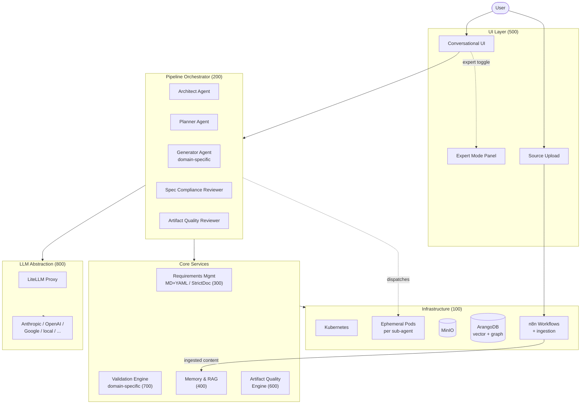

# Platform Synthesis — Requirements-Driven Conversational Artifact Generation

> **Purpose of this document.** Anchor the cross-cutting decisions that constrain all detailed specs (`100`–`800`) and `meta/`. This is the single source of truth for platform-wide trade-offs. Detailed technical specifications live in their respective documents; this document holds the **why** and the **what**, not the **how**.

> **Version 4 changes.** Clarification of `D-001` (bumped to `version: 2`): StrictDoc is adopted as a **tooling library** (validation, traceability matrices, export), not as the **native storage format**. The native storage format is Markdown with YAML frontmatter, already used by the delivered specs. This clarification resolves an ambiguity surfaced during the `300-SPEC-REQUIREMENTS-MGMT` design discussion; no other decision is impacted.

---

## 1. Context & Vision

The platform enables users to produce software artifacts — and, progressively, other kinds of structured deliverables — by **conversing with AI under a disciplined engineering process**, not by directly typing the artifact. It replaces the "vibe coding" / "vibe authoring" paradigm — fast but unverified — with a **requirements-driven conversational generation** model where every produced artifact is traceable to an explicit, versioned requirement, and every requirement is continuously validated against its implementation.

The platform targets users who want AI-accelerated delivery **without** sacrificing the rigor expected in regulated or high-stakes contexts (automotive cybersecurity, ASPICE, safety-critical systems). It is deployed on Kubernetes (local via Docker Desktop, production via AKS), reusing an existing stack of open-source components (MinIO, ArangoDB, n8n).

**Production domain model.** The platform operates on a notion of **production domain**: a class of artifact for which a dedicated generation and validation pipeline exists. v1 implements the `code` domain exclusively. Subsequent versions progressively add other domains (`documentation`, `presentation`, ...) by registering new pipelines against the same architectural backbone.

**Primary user flow** (domain-agnostic):

1. The user describes a need through a structured conversational UI.
2. The platform decomposes the need into **requirements** (stored as Markdown with YAML frontmatter, indexed via StrictDoc tooling), refines them through human-validated iterations, and commits them to a versioned corpus.
3. A pipeline of specialised AI agents drafts design, plans implementation, generates the target artifacts and their domain-specific validation artifacts (tests for `code`, acceptance checks for other domains), and performs dual review.
4. Continuous **vertical coherence checks** (parameterised per production domain) enforce bidirectional traceability between requirements and produced artifacts.
5. Released artifacts are persisted to MinIO and optionally pushed to an external destination via n8n (Git remote for `code`, file share for `documentation`, etc.).

**External source ingestion.** Users provide documents, images, and other sources to enrich the platform's RAG context (project-specific knowledge base). The ingestion pipeline is a first-class platform capability, aligned with prior work done on the simplechat project.

---

## 2. Glossary

| Term | Definition |
|---|---|
| **Entity** | Any trackable object with a stable identifier and YAML frontmatter (requirement, decision, validation artifact, etc.). |
| **Requirement (`R-XXX`)** | A unit of expected behaviour, constraint, or property. Lives in a `SPEC-*.md` file. |
| **Decision (`D-XXX`)** | A cross-cutting architectural or methodological choice. Lives in `999-SYNTHESIS.md`. |
| **Validation artifact (`T-XXX`)** | Executable or verifiable acceptance criterion tied to one or more requirements. For `code` domain: a test. For future domains: a checklist, an approval gate, an automated content check. |
| **Production domain** | A registered class of artifact with its dedicated generation pipeline and validation engine (e.g. `code`, `documentation`, `presentation`). |
| **Platform level** | Requirements that are invariant across all projects hosted on the platform. |
| **Project level** | Requirements scoped to a specific user project, potentially tailoring platform-level requirements. |
| **Tailoring** | The act of overriding or refining a parent requirement with an explicit marker and justification. |
| **Vertical coherence** | Bidirectional, machine-checkable alignment between the requirements corpus and the produced artifact corpus. Check set is parameterised per domain. |
| **Sub-agent** | A fresh, context-isolated AI worker dispatched to perform a single bounded task within the pipeline. |
| **Hard gate** | A non-negotiable checkpoint in the pipeline that cannot be bypassed without explicit human override. Formulation is domain-agnostic. |
| **`@relation` marker** | Inline artifact annotation declaring that a block implements, validates, or otherwise relates to a specific entity. Syntax per artifact format; defined in `meta/100-SPEC-METHODOLOGY.md` §8. |
| **External source** | A user-uploaded document (PDF, DOCX, image, etc.) ingested to enrich the project's RAG context. Distinct from produced artifacts. |
| **Storage format** | The native on-disk format for requirement documents: Markdown with YAML frontmatter. |
| **Tooling library** | StrictDoc used as a library for validation, traceability matrices, and HTML export, without adopting its native `.sdoc` format. |

---

## 3. Guiding Principles

1. **Rigor before helpfulness.** The platform prefers refusing or pausing over generating unverified work. Speed is a consequence of discipline, not a trade-off against it.
2. **Traceability by construction.** No requirement exists without a path to a produced artifact and its validation; no produced artifact exists without a path to at least one requirement.
3. **Open source reuse over reinvention.** Every platform capability must first be evaluated against existing mature OSS projects, including prior internal work (simplechat, AyExtractor). Custom development is justified only when no acceptable alternative exists.
4. **Human-in-the-loop at gates.** Autonomy is maximized within phases; human approval is mandatory at phase transitions (spec approval, plan approval, release).
5. **Provider-agnostic by design.** The platform abstracts LLM providers so that any agent can run on any compatible model without application code changes.
6. **Simplicity first.** When two designs satisfy the same requirements, the simpler one wins. Complexity must be justified by a concrete requirement, not by speculative future needs.
7. **Sub-agents over monolithic context.** Long-running tasks are decomposed into fresh, context-isolated sub-agents to preserve focus and auditability.
8. **Domain-extensible backbone, domain-specific pipelines.** The architectural backbone (orchestration, requirements management, memory, LLM abstraction) is domain-agnostic. Generation and validation logic is packaged per production domain and registered against the backbone.

---

## 4. High-Level Architecture



The orchestrator drives the five-phase pipeline (brainstorm → spec → plan → generate → dual review), parameterised by the active production domain. Each phase may spawn ephemeral sub-agent pods with isolated context. All LLM calls route through the LiteLLM proxy. The requirements corpus, generated artifacts, and ingested sources live in MinIO and ArangoDB; n8n handles ingestion, post-release workflows, and external sync.

---

## 5. Cross-cutting Decisions

Each decision below is a trackable entity. Detailed specs reference these identifiers via `derives-from:` or `impacts:` fields.

### 5.1 StrictDoc adoption

```yaml
id: D-001
version: 2
status: approved
category: tooling
impacts: [R-300-*, R-600-*, R-700-*]
```

**Decision.** StrictDoc is adopted as a **tooling library** for requirements management. StrictDoc provides validation, traceability matrices, relationship graph analysis, and HTML export. The platform **does NOT** adopt StrictDoc's native `.sdoc` format as its on-disk storage. The native storage format is **Markdown with YAML frontmatter**, as used by the specs already delivered (`999-SYNTHESIS.md`, `meta/100-SPEC-METHODOLOGY.md`, `100-SPEC-ARCHITECTURE.md`).

**Rationale.**
- Markdown + YAML is already the format used throughout the platform's own specs; consistency matters.
- Markdown renders natively in Git forges, IDEs, and documentation viewers without tooling.
- YAML frontmatter is parseable by every language ecosystem and supports arbitrary custom fields (needed for `derives-from`, `impacts`, `tailoring-of`, `override`, `supersedes`, `superseded-by`, `deprecated-reason`, `domain`) without inventing a custom DSL.
- StrictDoc's value is in its validation rules, matrix generation, and export — all of which can operate on a projected in-memory model built from Markdown + YAML.
- Avoids maintaining a custom StrictDoc grammar file to express our extended entity schema.

**Alternatives considered.**
- Native `.sdoc` format with custom grammar: rejected; higher maintenance cost, breaks git/IDE rendering parity.
- Sphinx-needs: rejected in v1 of this decision (heavier, Sphinx-coupled).
- Doorstop: rejected (less active, weaker tooling).
- Custom format without any library: rejected; reinvents traceability matrices and coherence rules.

**Consequences.**
- `300-SPEC-REQUIREMENTS-MGMT.md` specifies the Markdown + YAML schema and the adapter that converts it to StrictDoc's in-memory model.
- StrictDoc is consumed as a Python dependency of C5 (Requirements Service) and C6 (Validation Pipeline Registry).
- Extensions or bug fixes to StrictDoc are contributed upstream where possible.
- The MCP Server (C9) exposes CRUD tools that operate on the Markdown + YAML format; StrictDoc is an implementation detail behind the API.

---

### 5.2 Existing stack reuse

```yaml
id: D-002
version: 1
status: approved
category: infrastructure
impacts: [R-100-*, R-400-*]
```

**Decision.** The platform reuses the existing stack: Kubernetes (Docker Desktop local, AKS production), MinIO for object storage, ArangoDB as unified vector + graph store, n8n for ingestion and automation workflows. No substitution is planned for v1.

**Rationale.** Existing operational familiarity; ArangoDB uniquely combines vector and graph in one engine; n8n already operational for automation.

**Risk flagged.** ArangoDB native vector search is younger than Qdrant/pgvector (available since 3.12, late 2024). Acceptable for expected volumes; plan B (pgvector or Qdrant as satellite) is documented in `100-SPEC-ARCHITECTURE.md`.

**Consequences.** Infrastructure specs assume these components as primitives. No abstraction layer is introduced to allow swapping them in v1.

---

### 5.3 Core library + three invocation surfaces

```yaml
id: D-003
version: 1
status: approved
category: architecture
impacts: [R-600-*, R-700-*]
```

**Decision.** Validation and related platform capabilities are implemented as a **single Python core library** with three invocation surfaces:

1. **CLI** — for Git hooks, CI/CD, n8n automation, and power users.
2. **MCP server** — for LLM agents (internal pipeline agents and external tools like Claude Code or Cursor).
3. **Direct Python import** — for the platform backend, avoiding unnecessary serialization.

**Rationale.** Single source of truth; three native integration points; no duplicated logic. Inverse pattern (MCP-only with CI calling via MCP) adds a network hop without benefit.

**Consequences.** The core library has strict API stability requirements. MCP and CLI are thin wrappers.

---

### 5.4 tree-sitter for multi-language AST parsing

```yaml
id: D-004
version: 1
status: approved
category: tooling
impacts: [R-700-*]
```

**Decision.** `tree-sitter` is adopted as the default AST backend for validation checks on the `code` production domain. For Python-only analysis, the `ast` standard library plus `libcst` remains acceptable within the core library.

**Rationale.** De facto standard for multi-language parsing (used by Neovim, Atom, GitHub); uniform API across languages; required for the platform's multi-language roadmap within the `code` domain.

**Consequences.** Supported languages are declared explicitly per check in `700-SPEC-VERTICAL-COHERENCE.md`. Adding a language = shipping a tree-sitter grammar and its check plugins. Non-code domains will register their own parsing backends (e.g. PPTX structure parser for `presentation`).

---

### 5.5 Hierarchy platform/project with explicit tailoring

```yaml
id: D-005
version: 1
status: approved
category: methodology
impacts: [R-300-*, R-700-*]
```

**Decision.** Requirements follow a two-level hierarchy: `platform` (invariant across projects) and `project` (user-specific). A project-level requirement MAY diverge from a platform-level parent **only via an explicit `override: true` marker with a textual justification**. Silent divergence is a coherence violation.

**Rationale.** Option retained after trade-off analysis: stricter rule (no divergence ever) was too rigid; detection-only was too permissive. Explicit marker aligns with ISO 21434 tailoring practice and provides auditable rationale.

**Consequences.** The vertical coherence engine (`check #9`, cross-layer) treats missing `override: true` as a blocking finding. The user-facing UI surfaces tailoring markers distinctly from regular edits. Operational syntax defined in `meta/100-SPEC-METHODOLOGY.md` §7.

---

### 5.6 Vertical coherence scope

```yaml
id: D-006
version: 1
status: approved
category: functional-scope
impacts: [R-700-*]
```

**Decision.** The vertical coherence engine ships with a staged scope, initially populated for the `code` production domain.

**MUST (v1, blocking in CI)** — `code` domain:
1. Requirement without code
2. Code without requirement
3. Interface signature divergence (caller vs callee)
4. Test absent for requirement
5. Orphan test (no requirement referenced)
6. Obsolete reference (dangling path after rename/deletion)
7. Requirement ↔ code version drift
8. Data model drift (Pydantic, dataclasses, JSON Schema)
9. Cross-layer coherence (platform ↔ project with explicit `override`)

**SHOULD (v2, advisory — non-blocking)** — `code` domain:
10. Real execution coverage (integration with `coverage.py`)
11. Requirement dependency cycles
12. Semantic duplication of requirements (embedding-based)
13. SMART quality scoring of requirements (LLM-based)

**COULD (roadmap)** — `code` domain:
14. NFR coverage by appropriate test type
15. ADR ↔ requirements linkage

**Rationale.** MUST is fully deterministic (static analysis). SHOULD introduces AI-based, non-deterministic checks: advisory by design, never blocking. Explicit staging avoids scope creep in v1.

**Consequences.** v2 introduces a hard dependency on the embeddings and LLM stack (see D-010, D-011). The engine ships with a per-check enable/disable configuration. Future domains (`documentation`, `presentation`) register their own check suites against the same engine API.

---

### 5.7 Staff-engineer pattern adoption

```yaml
id: D-007
version: 1
status: approved
category: pipeline-design
impacts: [R-200-*, R-600-*]
```

**Decision.** The pipeline orchestrator is inspired by the `claude-code-staff-engineer` pattern (FareedKhan-dev). The v1 scope retains the following subset:

- **Five-phase pipeline**: brainstorm → spec → plan → generate → dual review (spec compliance then artifact quality).
- **Three hard gates** (formulated domain-agnostically):
  - no artifact generation before design approval;
  - no production-grade artifact without its validation artifact failing first (domain-appropriate form: failing test for `code`, unmet acceptance checklist for `documentation`, etc.);
  - no completion claim without fresh verification evidence.
- **Fresh sub-agents per task** with isolated context, materialized as ephemeral Kubernetes pods.
- **Four escalation statuses**: `DONE`, `DONE_WITH_CONCERNS`, `NEEDS_CONTEXT`, `BLOCKED`.
- **Three-fix rule**: after three failed fix attempts, the pipeline halts and surfaces an architectural-review request to the human.

**Deferred to v2.** Fine-grained model selection per task complexity; forensic debugging workflow (4-phase, 5-level root-cause); skill academy (self-authoring skills); dedicated Git worktree management layer.

**Excluded.** Visual companion (browser-side mockup renderer) — the platform's own UI supersedes this need.

**Rationale.** The pattern encodes battle-tested engineering discipline as an orchestrator contract. Adapted for a multi-user web platform rather than a single-developer CLI tool. Phase-level discipline is domain-agnostic; generation and validation logic per phase is domain-specific.

**Consequences.** `200-SPEC-PIPELINE-AGENT.md` becomes the most substantial functional spec. Each agent's LLM feature requirements (see D-011) are declared explicitly per phase. Domain-specific agent implementations register against a domain-agnostic pipeline contract.

---

### 5.8 Agent exposure: hybrid (invisible + expert mode)

```yaml
id: D-008
version: 1
status: approved
category: ux
impacts: [R-500-*, R-200-*]
```

**Decision.** The pipeline agents (Architect, Planner, Generator, Reviewers) are **hidden by default** from the end user, who experiences a single coherent conversation. A togglable **expert mode** exposes which agent is currently active, the pipeline phase, intermediate artifacts, and sub-agent dispatches.

**Rationale.** Default UX matches user mental model ("I'm talking to the platform"). Expert mode serves debugging, auditability, and power users (our target persona in regulated contexts).

**Consequences.** UI spec (`500`) defines both modes. Internal events (phase transitions, dispatches, escalations) must be emitted on a bus consumable by the UI regardless of mode, to avoid coupling agent logic to presentation.

---

### 5.9 Default language: English, overridable per document

```yaml
id: D-009
version: 1
status: approved
category: methodology
impacts: [all SPEC-*.md]
```

**Decision.** All platform-authored requirements documents default to English (`language: en` in frontmatter). Any document may override via a per-file `language:` field. User-authored project requirements follow the user's preference with no translation pipeline.

**Rationale.** English aligns with ISO 21434 and international conventions; per-document override accommodates native-language authoring where it improves precision.

**Consequences.** Tooling must not assume uniform language across the corpus. The vertical coherence engine operates on identifiers and structural relations, not natural-language content — language-agnostic by construction for MUST checks.

---

### 5.10 Graph-backed embeddings on ArangoDB — approach (A) + (α)

```yaml
id: D-010
version: 1
status: approved
category: memory-rag
impacts: [R-400-*, R-700-*]
```

**Decision.** The memory and RAG layer uses text embeddings (approach **A**: standard sentence-transformers applied to entity and source content) stored in ArangoDB, with similarity propagation leveraging the existing graph structure. Refresh strategy **α**: periodic recomputation (cron or commit-triggered). No node2vec/GraphSAGE in v1; no online fine-tuning; no feedback-loop re-ranker.

**Rationale.** Maximises value while minimising ML complexity. Node embeddings (B) and hybrid GraphRAG (C) are deferred to v2/v3 only if v1 performance is demonstrably insufficient. Feedback-loop improvement (β) is deferred to v2; continuous fine-tuning (γ) is out of scope.

**Consequences.** v2 SHOULD-scope vertical coherence checks (semantic duplication, SMART scoring) consume this layer. Both the requirements corpus and external sources (see D-013) are embedded; retrieval is federated across separated indexes. Specific embedding model choice and refresh cadence are detailed in `400-SPEC-MEMORY-RAG.md`.

---

### 5.11 Multi-LLM abstraction via LiteLLM

```yaml
id: D-011
version: 1
status: approved
category: architecture
impacts: [R-100-*, R-200-*, R-800-*]
```

**Decision.** All LLM calls route through a **single LiteLLM proxy** deployed in the Kubernetes cluster. Every agent uses the OpenAI-compatible endpoint (`/v1/chat/completions`) exposed by the proxy. Provider keys, routing rules, rate limits, and budget caps are centralised in the proxy configuration.

**Scoped staging**:
- **Level 1 — portability (MUST v1)**: one active provider at a time, swappable via configuration without code changes.
- **Level 2 — task-based routing (SHOULD v2)**: different providers/models per agent or per task complexity.
- **Level 3 — ensemble/fallback (COULD roadmap)**: parallel invocation and result aggregation for critical decisions.

**Rationale.** LiteLLM is the de facto open-source standard (100+ providers); proxy mode yields centralised observability, cost tracking, and zero application-code churn on provider change. Replaceable by any OpenAI-compatible alternative (Portkey, vLLM gateway) should it become necessary.

**Caveats (explicit).**
- **Feature parity is not automatic**: prompt caching, structured outputs, vision, tool calling, context window vary across providers. Per-agent LLM feature requirements are declared explicitly in `200-SPEC-PIPELINE-AGENT.md`.
- **Prompts are not portable for free**: v1 uses generic prompts with per-provider regression testing; v2 may introduce a per-provider prompt library if degradation is observed.
- **Quality monitoring**: a systematic eval harness across active providers is scheduled for v2.

**Consequences.** `800-SPEC-LLM-ABSTRACTION.md` is a first-class spec document. The orchestrator never embeds provider-specific logic.

---

### 5.12 Production domain extensibility

```yaml
id: D-012
version: 1
status: approved
category: architecture
impacts: [R-100-*, R-200-*, R-300-*, R-600-*, R-700-*]
```

**Decision.** The platform architecture is organised around the notion of **production domain**: a pluggable unit comprising a generation pipeline and a validation pipeline for a given class of artifact. The v1 implementation targets exclusively the `code` domain. The architectural backbone (Gateway, Auth, Conversation, Orchestrator, Requirements, Memory, LLM Gateway, MCP Server) SHALL be domain-agnostic. Generation and validation logic SHALL be packaged per domain and registered against the backbone.

**Roadmap:**
- **v1**: `code` domain only.
- **v2**: `documentation` domain (Markdown, HTML, PDF outputs with narrative coherence checks, completeness checks, reading-level scoring).
- **v3**: `presentation` domain (PPTX with slide-level structure, brand compliance, narrative arc).
- **v4+**: on-demand, based on user needs.

**Constraints on v1 design:**
- No backbone component SHALL hard-code "code", "test", "function", "class" or similar code-specific vocabulary in its public contracts. Internally, `code`-domain components may use such terms.
- Hard gates SHALL be formulated in terms of abstract concepts ("artifact", "validation artifact") rather than concrete code terms ("code", "test").
- The `@relation` marker mechanism SHALL be portable to non-code artifacts (Markdown docstrings, DOCX properties, PPTX slide notes, YAML sidecar files).
- Validation engine API SHALL be parametric on the domain, with check plugins registered per domain.

**Rationale.** Option B (full generalisation at v1) chosen over option A (minimal D-012 + refactor at v2). Justification: the refactor cost at v2 would exceed the v1 generalisation cost, as decisions on naming, contracts, and data model are cheaper to get right once than to revisit. Risk acknowledged: premature abstraction. Mitigation: no abstraction without a concrete v1 user (the `code` domain) exercising it.

**Alternatives considered.** Option A was the safer default per YAGNI principle but was rejected because:
- The refactor scope at v2 would touch every major spec.
- Several naming decisions (component names, entity type semantics, hard gate formulations) are effectively irreversible in v2 without breaking change.
- The user's medium-term intent is explicitly multi-domain; anchoring this now reduces uncertainty.

**Consequences.**
- `999-SYNTHESIS.md`, `meta/100-SPEC-METHODOLOGY.md`, and `100-SPEC-ARCHITECTURE.md` are refactored in sync with this decision (v3, v2, v2 respectively).
- The former "Analysis Engine" (C6) becomes a **Validation Pipeline Registry** hosting domain-specific validation plugins.
- The notion of "test" at methodology level is replaced by "validation artifact" (`T-` entity type retained with broader semantics).
- Open question: registration mechanism for new domains at runtime vs at build time (deferred to v2 when the second domain lands).

---

### 5.13 External source ingestion

```yaml
id: D-013
version: 1
status: approved
category: memory-rag
impacts: [R-100-*, R-400-*, R-500-*]
```

**Decision.** The platform SHALL provide a first-class capability for users to upload external sources (documents, images, structured data) into a project's RAG context. Ingestion is handled by the combination of:

- **C12 (Workflow Engine, n8n)** — upload reception, per-type parsing, job orchestration (retry, progress, monitoring).
- **C7 (Memory Service)** — embedding computation and indexing into ArangoDB (both vector and graph collections).

No new component is introduced. Parsing, chunking strategy, and schema details SHALL align with the prior work done on the **simplechat** and **AyExtractor** projects to avoid reinventing the ingestion pipeline.

**v1 supported formats (option (i) — minimum set):**
- PDF
- Markdown (`.md`)
- Plain text (`.txt`)
- Images (PNG, JPG) with optional OCR

**Deferred to later versions:**
- v2: DOCX, PPTX, XLSX (office suite)
- v3: HTML, JSON/YAML/CSV, URL crawling
- v4: external Git repository cloning and ingestion

**Retrieval model.** The RAG retrieval is **federated across separated indexes**:
- Index `requirements`: owned by C5, contains the versioned requirements corpus.
- Index `external_sources`: owned by C7, contains ingested user-provided sources.
- Retrieval API supports querying either index, or both with explicit weighting.

**Rationale.**
- First-class ingestion is a user-facing value (users bring their own documentation, standards, legacy specs).
- Minimum v1 format set (option (i)) covers the highest-value cases without ballooning parsing library dependencies. Progressive enrichment per version.
- Reuse of simplechat / AyExtractor work respects Principle 3 (OSS reuse, including prior internal work).
- Federated retrieval with separated indexes prevents contamination (a PDF snippet being treated as a requirement).

**Pending.** Technical alignment with the simplechat and AyExtractor codebases is pending — the specification files have not yet been accessed. Specific decisions on parsing library selection (docling as current candidate baseline, pending confirmation), chunking strategy (size, overlap, structure-aware), deduplication mechanism, and ArangoDB collection schema are deferred to `400-SPEC-MEMORY-RAG.md` once alignment is done.

**Consequences.**
- `100-SPEC-ARCHITECTURE.md` (v2) adds requirements on C7 and C12 for ingestion.
- `400-SPEC-MEMORY-RAG.md` becomes a first-class spec (not only internal memory): it covers the ingestion pipeline, the parsing per format, the chunking and embedding strategies, and the federated retrieval API.
- `500-SPEC-UI-UX.md` includes the upload UX (drag-and-drop, progress, error handling, source management).
- RBAC extension: per-project source visibility and ownership, aligned with existing project roles (E-100-002).
- Quotas: storage quota per project/tenant for external sources (deferred details to Q-100 / `400`).

---

## 6. Document Mapping

| Cluster | Document | Scope | Status |
|---|---|---|---|
| Infrastructure | `100-SPEC-ARCHITECTURE.md` | K8s topology, sandboxing, Python/Rust component split, deployment targets, domain-agnostic backbone, env-file architecture (§10) | **v3 delivered** |
| Pipeline | `200-SPEC-PIPELINE-AGENT.md` | Five-phase pipeline, hard gates, sub-agents, escalation, LLM feature requirements per agent, domain plug-in contract | **v2 delivered** |
| Requirements mgmt | `300-SPEC-REQUIREMENTS-MGMT.md` | Markdown+YAML storage, StrictDoc tooling, CRUD API, versioning, tailoring enforcement, import/export | **v1 delivered** |
| Memory / RAG | `400-SPEC-MEMORY-RAG.md` | Graph-backed embeddings, short/long-term memory, external source ingestion, federated retrieval | **v2 delivered** |
| UI / UX | `500-SPEC-UI-UX.md` | Conversational UI, expert mode, structured elicitation, requirements surface, source upload UX | planned (scaffold) |
| Artifact quality | `600-SPEC-CODE-QUALITY.md` | Domain-specific quality enforcement (TDD for `code`, equivalent per-domain gates), dual review, evidence-based verification | planned (scaffold) |
| Vertical coherence | `700-SPEC-VERTICAL-COHERENCE.md` | MUST/SHOULD/COULD checks per domain, parser internals, reporting, domain plugin registration | **v3 delivered** |
| LLM abstraction | `800-SPEC-LLM-ABSTRACTION.md` | LiteLLM deployment, routing, feature mapping, eval harness | **v1 delivered** |
| Methodology | `meta/100-SPEC-METHODOLOGY.md` | Authoring conventions, versioning, git flow, review process, domain-neutral entity model, test tier topology (§11) | **v3 delivered** |

---

## 7. Open Questions Deferred to Detailed Specs

| # | Question | Document | Owning decision |
|---|---|---|---|
| Q1 | Python/Rust split per component (which components require Rust?) | `100` | D-002 |
| Q2 | Exact LiteLLM deployment shape (sidecar per namespace vs shared service)? | `100`, `800` | D-011 |
| Q3 | Sub-agent pod lifecycle details (init container, MinIO sync strategy)? | `100`, `200` | D-007 |
| Q4 | Concrete StrictDoc API usage and adapter layer specifics. | `300` | D-001 |
| Q5 | Embedding model selection (specific sentence-transformers model, local vs API)? | `400` | D-010 |
| Q6 | Expert mode event bus design (WebSocket, SSE, backend-driven)? | `500` | D-008 |
| Q7 | Exact static-analysis toolchain per supported language? | `600`, `700` | D-003, D-004 |
| Q8 | LLM feature matrix per agent (caching required? structured output required?) | `200`, `800` | D-011 |
| Q9 | Per-check enable/disable configuration format for vertical coherence engine? | `700` | D-006 |
| Q10 | Eval harness design for v2 (golden dataset, metrics, schedule)? | `800` | D-011 |
| Q11 | Domain registration mechanism (build-time vs runtime, schema for domain plugins) | `200`, `700` | D-012 |
| Q12 | Technical alignment with simplechat/AyExtractor ingestion pipeline (parsing libs, chunking, schema) | `400` | D-013 |
| Q13 | Storage quotas per project/tenant for external sources | `100`, `400` | D-013 |

---

## 8. Roadmap (indicative)

**v1 — Foundation (code domain)**
- D-001 through D-013 at their v1-scoped level
- `code` production domain fully implemented
- Vertical coherence: MUST checks (#1–#9) enforced for `code`
- LLM abstraction: portability (level 1)
- Staff-engineer pattern: five phases + three hard gates + sub-agents + four statuses + three-fix rule
- Embeddings: text-based + periodic refresh
- External source ingestion: option (i) formats (PDF, MD, TXT, images)
- Single active LLM provider, swappable

**v2 — Discipline, Intelligence & Documentation domain**
- `documentation` production domain registered
- Vertical coherence: SHOULD checks (#10–#13) for `code`, initial MUST set for `documentation`
- LLM abstraction: task-based routing (level 2)
- Staff-engineer pattern: fine model selection, forensic debugging, skill academy
- Embeddings: feedback-loop re-ranking (β)
- External source ingestion: option (ii) formats (DOCX, PPTX, XLSX)
- Eval harness across providers
- Per-provider prompt library (if regression observed)

**v3 — Optimisation & Presentation domain**
- `presentation` production domain registered
- Vertical coherence: COULD checks (#14–#15) for `code`
- LLM abstraction: ensemble / parallel invocation (level 3) for critical decisions
- Embeddings: node2vec / GraphSAGE / hybrid GraphRAG (if measured need)
- External source ingestion: option (iii) formats (HTML, JSON/YAML/CSV, URL crawling)
- Advanced worktree management
- Platform-wide observability and SLOs

**v4+ — Domain expansion on demand**
- External source ingestion: option (iv) Git repo ingestion
- Additional production domains registered based on concrete user needs

---

**End of 999-SYNTHESIS.md v4.**
